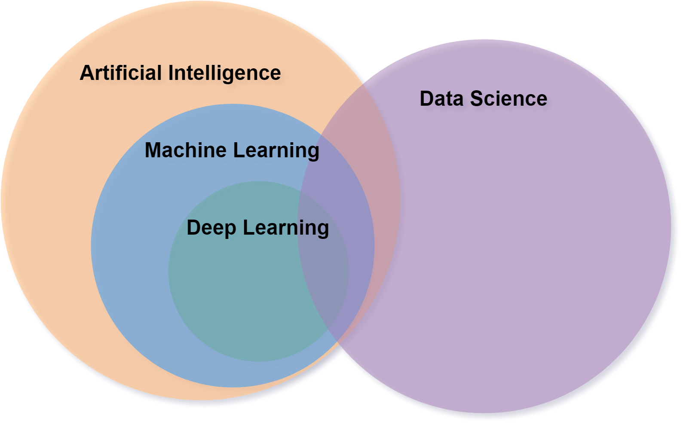
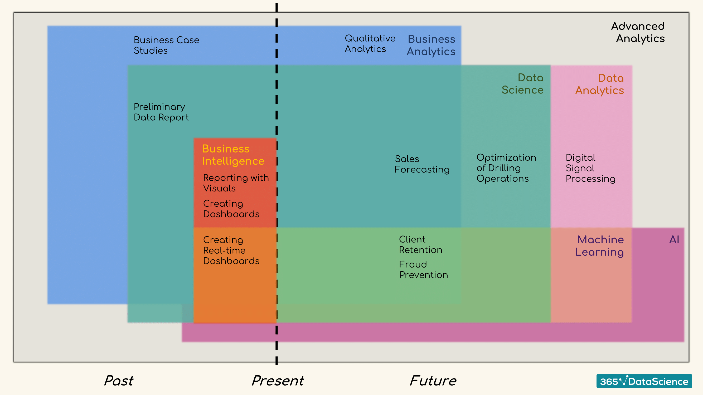

# Introduction to Intelligence

## Fields

### Intelligence

**Intelligence** is the ability to:

- acquire and apply knowledge and skills
- learn from experience
- recognize and solve problems

### Artificial Intelligence

**Artificial Intelligence** is the science and engineering behind the making of intelligent machines and computer programs for complex problem solving, such as visual perception, speech recognition, decision-making, and language translation.

### Machine Learning

**Machine Learning** is the branch of Artificial Intelligence which focuses on the use of data and algorithms to improve automatically through experience in order to solve problems.

### Deep Learning

**Deep Learning** is a subset of Machine Learning that uses programmable **neural networks** to learn and solve complex problems.

### Data Science

**Data Science** is an interdisciplinary field that uses scientific methods, processes, algorithms and systems to extract knowledge and insights from noisy, structured and unstructured data, and apply knowledge and actionable insights from data across a broad range of application domains.

## Categorization of Systems

&nbsp; | Humanly | Rationally
--- | --- | ---
**Thinking** | Thinking humanly — cognitive modeling. Systems should solve problems the same way humans do. | Thinking rationally — the use of logic. Need to worry about modeling uncertainty and dealing with complexity.
**Acting** | Acting humanly — the Turing Test approach. | Acting rationally — the study of rational agents: agents that maximize the expected value of their performance measure given what they currently know.

### Rational Systems

**Rational Systems** are ones that:

1. **Think Rationally**
	- Use logic to achieve goals via logical inferencing
	- Hard to represent informal knowledge
	- Not all problems solvable in this manner (e.g. uncertainty)
2. **Behave Rationally**
	- Amenable to computation
	- More general than inferencing (but can use inferencing)
	- Actions taken to achieve a goal are not necessarily "correct", but accomplish task at hand

## Intelligent Agents

### Agents

An **Agent** is something that senses its environment and acts on it.

### Rational Agents

A **Rational Agent** is one that, for each perceived sequence of events, it does what is expected to maximize performance on the basis of perceptual history and built-in knowledge.

### Types of Agents

1. **Simple Reflex Agents**
	- Agents that utilize simple table-lookup approach to solve problems and require fully observable environment.
2. **Model-Based Reflex Agents**
	- Agents that use state information to handle partially observable environments.
3. **Goal-Based Agents**
	- Agents that know the end goal and make decisions according to desirable situations.
4. **Simple Reflex Agents**
	- Agents that can use a measure of success at a given state to help make decisions.
5. **Simple Reflex Agents**
	- Agents that can learn situations that affect performance and learn how to change to improve.

## Environments

### Fully Observable vs Partially Observable

In a **fully observable** environment, an agent can sense or access the complete state of the environment that are relevant to the choice of action at each point of time.

In a **partially observable** environment, an agent can only sense or access part of the state of the environment at each point of time. This may be because of noisy or inaccurate sensors, or because parts of the state are simply missing.

### Deterministic vs Stochastic

In a **deterministic** environment, an agent's current state and selected action can completely determine the next state of the environment.

In a **stochastic** environment, it is difficult or impossible to determine the next state of the environment given the agent's current state and selected action. Stochastic environments tend to have randomness in nature.

### Episodic vs Sequential

In an **episodic** environment, selection of the current action only depends on the current state, and not on any past actions.

In a **sequential** environment, selection of the current action may depend on past actions. At the same time, the current decision may affect future decisions.

### Static vs Dynamic

**Static** environments remain unchanged while an agent is deliberating.

**Dynamic** environments may change while an agent is deliberating. In dynamic environments, an agent may need to keep observing the environment to detect changes at each action.

### Discrete vs Continuous

A **discrete** environment has finite number of percepts and actions that can be performed within it.

A **continuous** environment may have infinite number of percepts or performable actions.

### Single-Agent vs Multi-Agent

A **single-agent** environment has only one agent involved.

A **multi-agent** environment may have multiple agents involved.

## Adaptive & Cooperative Algorithms

### Adaptation

**Adaptation** is the ability to adjust to new or different situation, and to improve behavior.

### Cooperation

**Cooperation** involves the sharing of responsibility between entities in a group in order to solve a joint problem and reach a common goal.

## Sources of Problem Complexity

- Multimodality
- Lack of exact mathematical model
- Non-differentiability
- Combinatorial nature
- Distributed nature

## Types of Problems

### Well-Structured Problems

**Well-structured problems** are problems for which the existing state and the desired state are clearly defined, and the methods to reach the desired state are fairly obvious.

### Ill-Structured Problems

**Ill-structured problems** are problems in which the existing and desired states are unclear, and hence, methods of reaching the desired state cannot be found.

&nbsp; | Well-Structured | Moderately-Structured | Ill-Structured
--- | --- | --- | ---
Goals | Well Defined | Usually Well Defined | Undefined
Beginning State | Well Defined | Well Defined | Well Defined
Actions | Well Defined | Many Possible Actions | Undefined
End State| Well Defined | Well Defined | Undefined
Constraints| Well Defined | Usually Well Defined | Usually Not Well Defined
Example | Starting a car | Fixing a car | Designing a car

## Optimization Methods

### Exact Algorithms

- Find the optimal solution
- High computational cost

### Approximate Algorithms

- Find near-optimal solution
- Low computational cost

## Approximate Algorithms

### Constructive Methods

**Constructive methods** involve starting from scratch and trying to build the complete solution by adding one component at a time.

### Local Search Methods

**Local search methods** involve starting from an initial solution and iteratively trying to replace the current solution with a better one.

## Problem Formulation

A search problem can be formulated by outlining the following components in the problem:

### State

The state of the problem is a complete or partial configuration of the agent's current state.

### Initial State

Initial state is the state in which the agent begins the search.

### Goal

The goal of the problem is the state(s) that are desirable. Once a goal state is reached, the search terminates.

### Actions

The actions are the different moves that the agent can perform at any state.

### Cost

The cost of a state is an quantification of how far the current state is from the initial state.