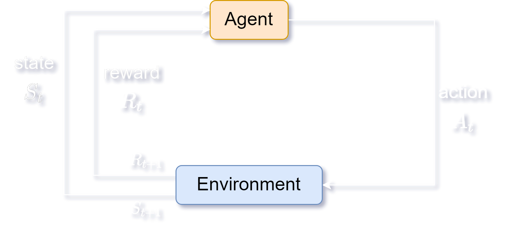

# Markov Decision Process

Consider an agent in an environment with state $\large S$, where the agent can choose to select an action $\large A$, and the environment responds with a reward $\large R$ and a new state.

$\large S_t$, $\large R_t$, and $\large A_t$ denote the state, reward given, and action taken at time $\large t$.

## Markov Property

An environment has the **Markov Property** if and only if the next state $\large S_{t+1}$ of the system depends only on the current state $\large S_t$ and the current action $\large A_t$, and not on past states or actions.
$$
\Large P\{R_{t+1} = r, S_{t+1} = s' | S_0, A_0, R_1, ... , S_{t-1}, A_{t-1}, R_t, S_t, A_t\} \\
= \Large P\{R_{t+1} = r, S_{t+1} = s' | S_t, A_t\}
$$

## Policy

The **policy** $\pi_t(a | s)$ at step $\large t$ is the probability of choosing action $\large a$ at state $\large s$.

## Episodic & Continuing Tasks

**Episodic tasks** are ones that have finite steps and a terminal state.

**Continuing tasks** are ones that do not end or have a terminal state,

## Return

Given the rewards $R_t$ given to the agent, the **return** $\large G_t$ is the expression we aim to maximize at any step.

### Total Reward

$$
\Large G_t = R_{t+1} + R_{t+2} + R_{t+3} + \: ... \: = \sum\limits^\infty_{k = 0} R_{t + k + 1}
$$

### Discounted Reward

$$
\Large G_t = R_{t+1} + \gamma R_{t+2} + \gamma^2 R_{t+3} + \: ... \: = \sum\limits^\infty_{k = 0} \gamma^k R_{t + k + 1}
$$

## Value & Action-Value Functions

The **value function** of a state $\large s$ under a policy $\large \pi$ is the expected return when starting in state $\large s$ and following $\large \pi$ hereafter:
$$
\Large v_\pi(s) = \mathbb{E}_\pi [G_t | S_t = s] \\[5pt]
\Large = \mathbb{E}_\pi \Bigg[\sum\limits^\infty_{k = 0} \gamma^k R_{t + k + 1} | S_t = s\Bigg]
$$
The **value function** of a state $\large s$ under a policy $\large \pi$ is the expected return when starting in state $\large s$, choosing action $\large a$, and following $\large \pi$ thereafter:
$$
\Large q_\pi(s, a) = \mathbb{E}_\pi [G_t | S_t = s, A_t = a] \\[5pt]
\Large = \mathbb{E}_\pi \Bigg[\sum\limits^\infty_{k = 0} \gamma^k R_{t + k + 1} | S_t = s, A_t = a\Bigg]
$$

### Bellman Equation

$$
\Large \begin{align*}
v_\pi(s) &= \mathbb{E}_\pi [G_t | S_t = s] \\[5pt]
&= \mathbb{E}_\pi \Bigg[\sum\limits^\infty_{k = 0} \gamma^k R_{t + k + 1} | S_t = s\Bigg] \\[5pt]
&= \mathbb{E}_\pi \Bigg[R_{t+1} + \gamma G_{t+1} | S_t = s\Bigg] \\[5pt]
&= \sum\limits_a \pi(a | s) \sum\limits_{s', r} p(s', r | s, a) \Big[r + \gamma v_\pi(s')\Big]
\end{align*}
$$