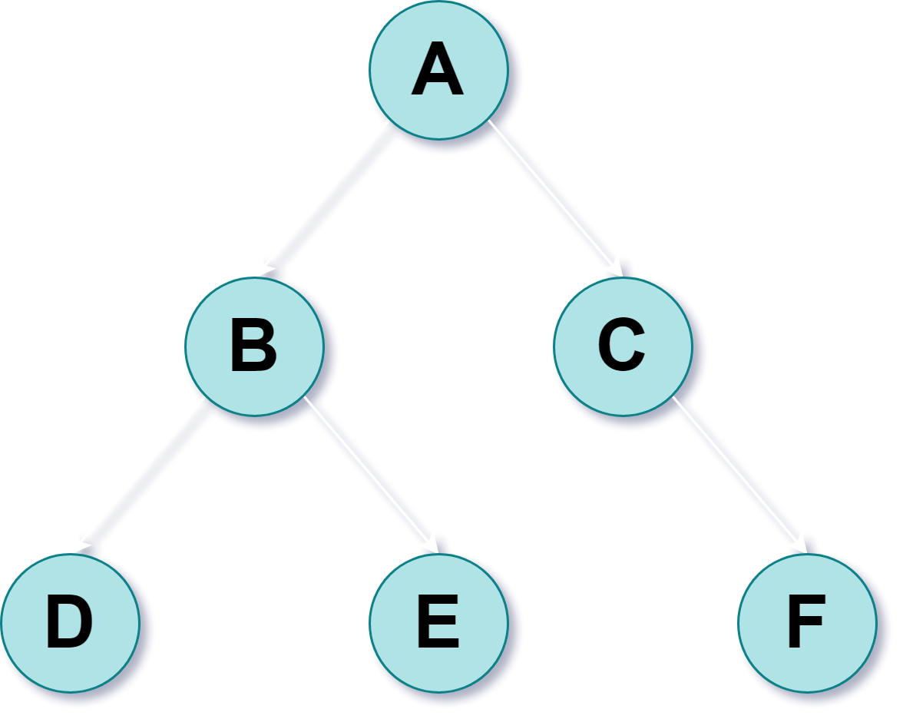
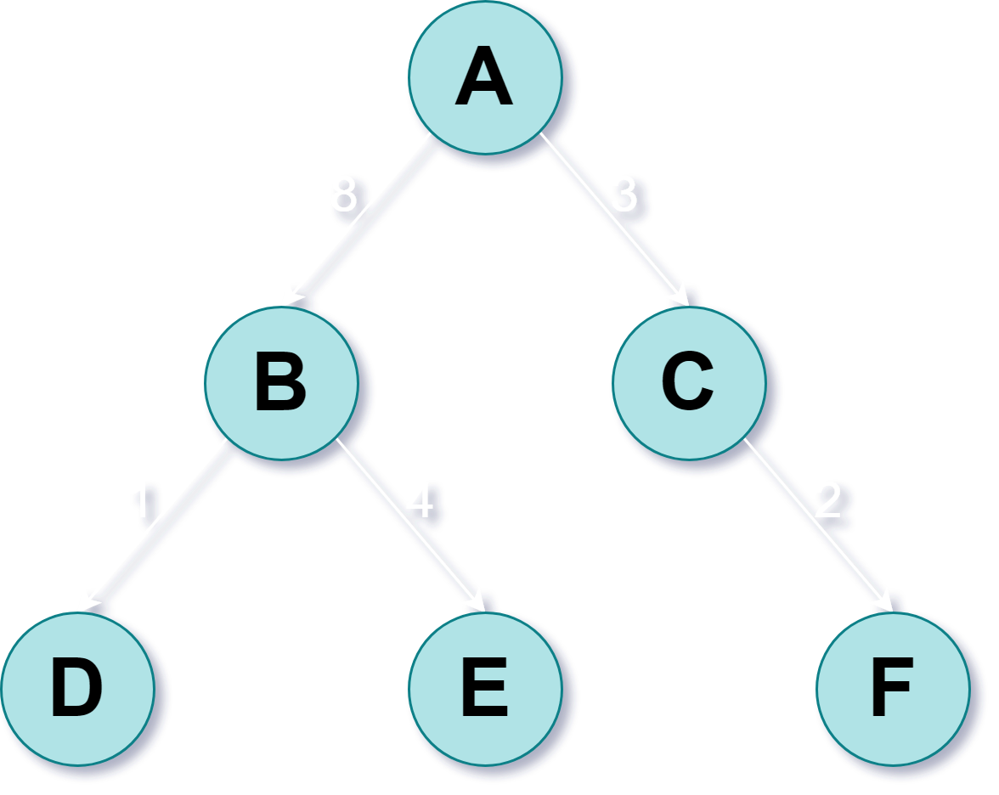

# Search Algorithms

## Properties of Search Algorithms

### Completeness

**Completeness** is whether or not the algorithm is guaranteed to find a goal (provided at least one goal exists).

### Optimality

**Optimality** is whether or not the algorithm is guaranteed to find the shallowest goal (i.e. the goal with the lowest cost).

### Time Complexity

**Time Complexity** refers to the degree of time consumed by the algorithm.

### Space Complexity

**Space Complexity** refers to the degree of memory space consumed by the algorithm.

## Search Tree Terminology

**Node:** a state in the search problem

**Edge:** an action or a transition between states in the search problem

**Branching Factor, $\large b$:** the maximum number of child nodes extending from a parent node

**Shallowest Goal Depth, $\large d$:** the number of edges to the shallowest goal node

**Maximum Depth, $\large m$:** the number of edges to the further node

## Heuristics

**Heuristics** are solution strategies by trial and error used to produce acceptable (optimal or sub-optimal) solutions to complex problems in a reasonably practical time. Heuristics aim to efficiently generate good solutions, but does not guarantee optimality. Heuristics:

- have short running times
- are easy to implement
- are flexible
- are simple

A heuristic function $\large h(n)$ is one that uses domain knowledge and estimates the *goodness* of node $\large n$. It is the estimated cost of the minimal cost path from node $\large n$ to a goal node.

### Admissible Heuristic

An **admissible heuristic** function is one that never overestimates the cost of reaching a goal:
$$
\Large h(n) \le h^*(n), \:\:\:\: \forall n
$$
where $\large h^*(n)$ is the true cost of the minimal cost path from node $\large n$ to a goal node.

## Breadth-First Search

**Breadth-First Search** involves searching the tree by expanding nodes into a queue data structure.

Search Path: $\large A \rarr B \rarr C \rarr D \rarr E \rarr F$

Property | Remarks
--- | ---
**Complete** | Yes, if $\large b$ is finite
**Optimal** | Yes, if path cost is equal to depth
**Time Complexity** | $\large O(b^{d + 1})$
**Space Complexity** | $\large O(b^{d + 1})$

## Depth-First Search

**Depth-First Search** involves searching the tree by expanding nodes into a stack data structure.

Search Path: $\large A \rarr B \rarr D \rarr E \rarr C \rarr F$

Property | Remarks
--- | ---
**Complete** | Yes, if $\large m$ is finite
**Optimal** | No
**Time Complexity** | $\large O(b^m)$
**Space Complexity** | $\large O(bm)$

## Uniform-Cost Search

**Uniform Cost Search** involves searching the tree by expanding nodes into a priority queue data structure based on the cost of the path to each node.

Search Path: $\large A \rarr C \rarr F \rarr B \rarr D \rarr E$

Property | Remarks
--- | ---
**Complete** | Yes
**Optimal** | Yes
**Time Complexity** | $\Large O(b^{\frac{C^*}{\epsilon} + 1})$
**Space Complexity** | $\Large O(b^{\frac{C^*}{\epsilon} + 1})$

$\large C^*$ and $\large \epsilon$ are costs of the goal path and the minimum cost of all the other edges respectively in the worst case scenario.

## Depth-Limited Search

**Depth-Limited Search** involves searching the tree using Depth-First Search, but limiting the maximum expanded depth to an upper bound $\large l$.

Search Path $(\large l = 2)$: $\large A \rarr B \rarr C$

Property | Remarks
--- | ---
**Complete** | Yes, if $\large l \ge d$
**Optimal** | No
**Time Complexity** | $\large O(b^l)$
**Space Complexity** | $\large O(bl)$

## Iterative-Deepening Search

**Iterative-Deepening Search** involves searching the tree using Depth-Limited Search using incremental values of $l$.

Search Path $(l = 1)$: $\large A$

Search Path $(l = 2)$: $\large A \rarr B \rarr C$

Search Path $(l = 3)$: $\large A \rarr B \rarr D \rarr E \rarr C \rarr F$

Property | Remarks
--- | ---
**Complete** | Yes, if $\large b$ is finite
**Optimal** | Yes, if path cost is equal to depth
**Time Complexity** | $\large O(b^d)$
**Space Complexity** | $\large O(bd)$

## Greedy Search

**Greedy Search** involves running Best-First Search with an evaluation function $\large f(n) = h(n)$, where $\large h(n)$ is the heuristic function.

Property | Remarks
--- | ---
**Complete** | No
**Optimal** | No
**Time Complexity** | $\large O(b^m)$
**Space Complexity** | $\large O(b^m)$

## Beam Search

**Beam Search** involves storing and expanding the $\large \beta$ best nodes at each depth to a queue data structure. $\large \beta$ is the beam width.

Property | Remarks
--- | ---
**Complete** | No
**Optimal** | No
**Time Complexity** | $\large O(\beta m)$
**Space Complexity** | $\large O(\beta m)$

## A* Search

**A* Search** involves running Best-First Search with an evaluation function $\large f(n) = g(n) + h(n)$, where $\large g(n)$ is the cost function.

Property | Remarks
--- | ---
**Complete** | Yes, if $\large h(n)$ is admissible
**Optimal** | Yes, if $\large h(n)$ is admissible

## Hill-Climbing Search

**Hill-Climbing** involves always traversing the node that decreases $\large h(n)$.

Property | Remarks
--- | ---
**Complete** | No
**Optimal** | No

## Max-Min Strategy

**Max-Min Strategy** (or the minimax algorithm) is a recursive backtracking algorithm that chooses the maximum or minimum value of the child nodes at any node.

Property | Remarks
--- | ---
**Complete** | Yes, if tree is finite
**Optimal** | Yes, if opponent is optimal opponent
**Time Complexity** | $\large O(b^d)$
**Space Complexity** | $\large O(bd)$