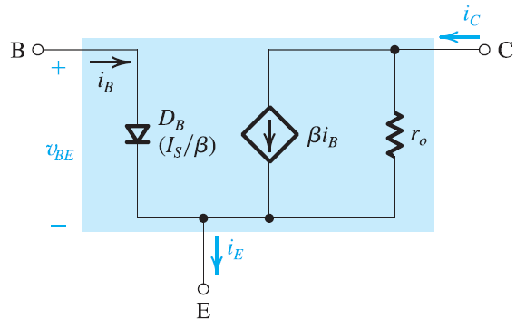
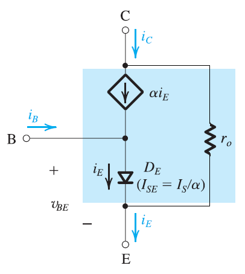
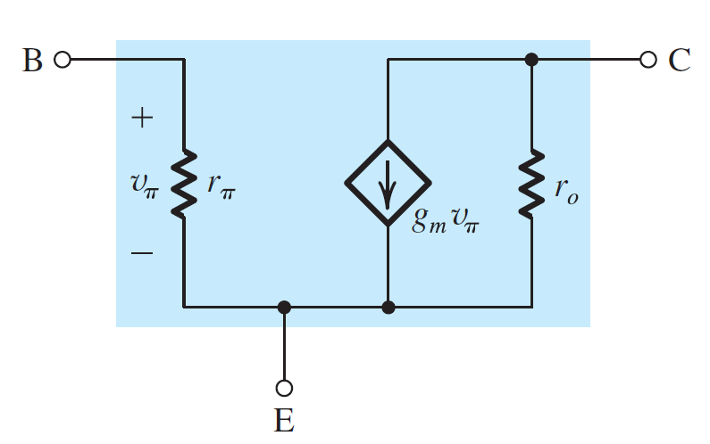
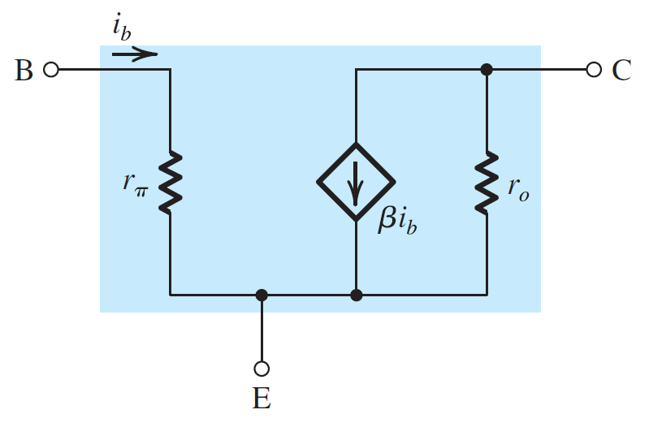
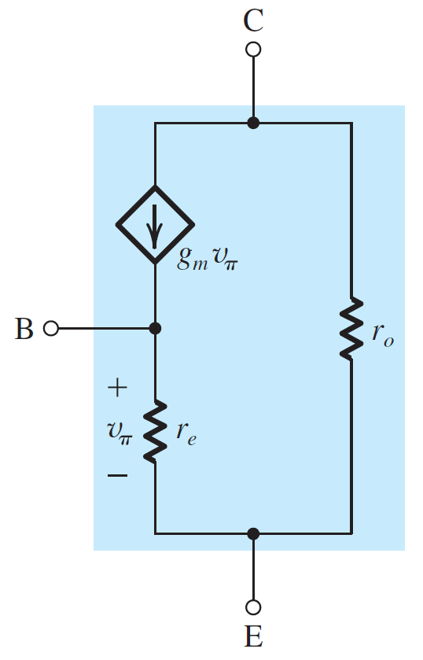
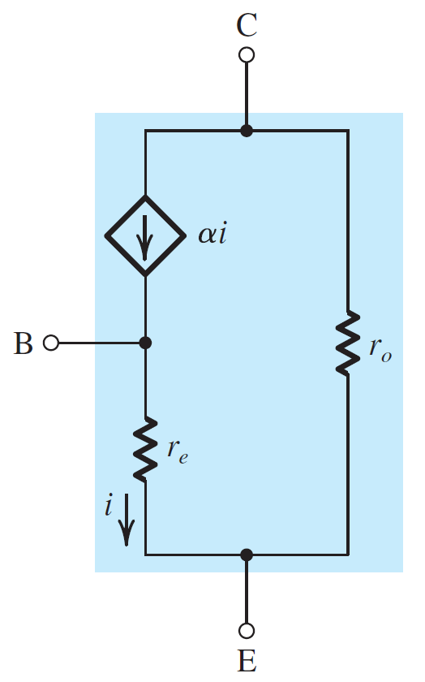
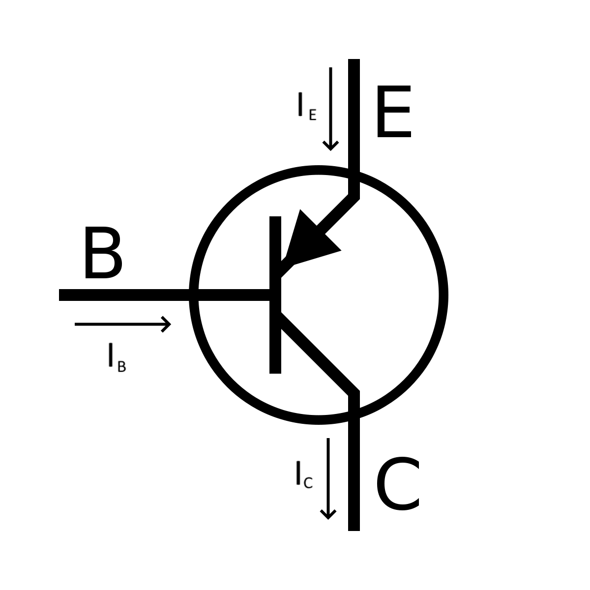
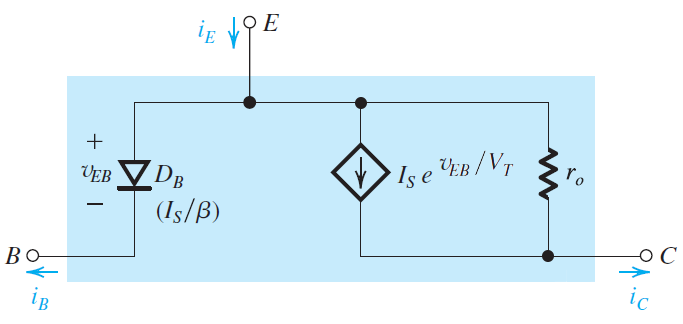
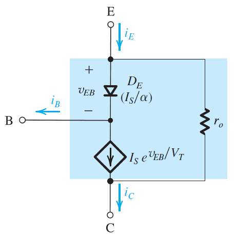

# Bipolar Junction Transistors (NPN)

## Symbol

## Active Mode

### Conditions:

$$
\Large
V_C \gt V_B \gt V_E
$$

### Equations:

$$
\Large
V_{BE} = 0.7\:\text{V} \\[25pt]
\Large
I_C = I_Se^{\frac{V_{BE}}{V_T}} \\[25pt]
\Large
I_B = \frac{1}{\beta}I_Se^{\frac{V_{BE}}{V_T}} \\[25pt]
\Large
I_E = I_C + I_B \\[25pt]
\Large
I_C = \beta I_B \\[25pt]
\Large
I_E = \frac{I_C}{\alpha} \\[25pt]
\Large
\alpha = \frac{\beta}{\beta + 1}
$$

## Saturations Mode

### Conditions:

$$
\Large
V_E \lt V_B \\[25pt]
\Large
V_C \lt V_B \\[25pt]
\Large
\frac{I_C}{I_B} \lt \beta
$$

### Equations:

$$
\Large
V_{BE} = 0.7\:\text{V} \\[25pt]
\Large
V_{CEsat} = 0.2\:\text{V}
$$

## Large Signal Model

## Small Signal Model

### $\pi$-model

$$
\Large
g_m = \frac{I_C}{V_T} \\[25pt]
\Large
r_\pi = \frac{V_T}{I_B} = \frac{\beta}{g_m} \\[25pt]
\Large
r_o = \frac{V_A}{I_C}
$$

### T-model

&nbsp;&nbsp;&nbsp;&nbsp;&nbsp;&nbsp;&nbsp;&nbsp;&nbsp;&nbsp;&nbsp;&nbsp;

$$
\Large
g_m = \frac{I_C}{V_T} \\[25pt]
\Large
r_e = \frac{V_T}{I_E} = \frac{\alpha}{g_m} \\[25pt]
\Large
r_o = \frac{V_A}{I_C}
$$

# Bipolar Junction Transistors (PNP)

## Symbol

## Active Mode

### Conditions:

$$
\Large
V_E \gt V_B \gt V_C
$$

### Equations:

$$
\Large
V_{EB} = 0.7\:\text{V} \\[25pt]
\Large
I_C = I_Se^{\frac{V_{EB}}{V_T}} \\[25pt]
\Large
I_B = \frac{1}{\beta}I_Se^{\frac{V_{EB}}{V_T}} \\[25pt]
\Large
I_C = I_E + I_B \\[25pt]
\Large
I_C = \beta I_B \\[25pt]
\Large
I_E = \frac{I_C}{\alpha} \\[25pt]
\Large
\alpha = \frac{\beta}{\beta + 1}
$$

## Saturations Mode (PNP)

### Conditions:

$$
\Large
V_B \lt V_E \\[25pt]
\Large
V_B \lt V_E \\[25pt]
\Large
\frac{I_C}{I_B} \lt \beta
$$

### Equations:

$$
\Large
V_{EB} = 0.7\:\text{V} \\[25pt]
\Large
V_{CEsat} = 0.2\:\text{V}
$$

## Large Signal Model

