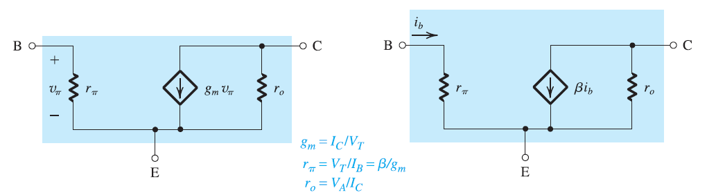

# Bipolar Junction Transistors (NPN)

## Symbol

## Active Mode

### Conditions:

$$
\huge
V_C \gt V_B \gt V_E
$$

### Equations:

$$
\huge
V_{BE} = 0.7\:\text{V} \\[25pt]
\huge
I_C = I_Se^{\frac{V_{BE}}{V_T}} \\[25pt]
\huge
I_B = \frac{1}{\beta}I_Se^{\frac{V_{BE}}{V_T}} \\[25pt]
\huge
I_E = I_C + I_B \\[25pt]
\huge
I_C = \beta I_B \\[25pt]
\huge
I_E = \frac{I_C}{\alpha} \\[25pt]
\huge
\alpha = \frac{\beta}{\beta + 1}
$$

## Saturations Mode

### Conditions:

$$
\huge
V_E \lt V_B \\[25pt]
\huge
V_C \lt V_B \\[25pt]
\huge
\frac{I_C}{I_B} \lt \beta
$$

### Equations:

$$
\huge
V_{BE} = 0.7\:\text{V} \\[25pt]
\huge
V_{CEsat} = 0.2\:\text{V}
$$

## Large Signal Model

## Small Signal Model

# Bipolar Junction Transistors (PNP)

## Symbol

## Active Mode

### Conditions:

$$
\huge
V_E \gt V_B \gt V_C
$$

### Equations:

$$
\huge
V_{EB} = 0.7\:\text{V} \\[25pt]
\huge
I_C = I_Se^{\frac{V_{EB}}{V_T}} \\[25pt]
\huge
I_B = \frac{1}{\beta}I_Se^{\frac{V_{EB}}{V_T}} \\[25pt]
\huge
I_C = I_E + I_B \\[25pt]
\huge
I_C = \beta I_B \\[25pt]
\huge
I_E = \frac{I_C}{\alpha} \\[25pt]
\huge
\alpha = \frac{\beta}{\beta + 1}
$$

## Saturations Mode (PNP)

### Conditions:

$$
\huge
V_B \lt V_E \\[25pt]
\huge
V_B \lt V_E \\[25pt]
\huge
\frac{I_C}{I_B} \lt \beta
$$

### Equations:

$$
\huge
V_{EB} = 0.7\:\text{V} \\[25pt]
\huge
V_{CEsat} = 0.2\:\text{V}
$$

## Large Signal Model

