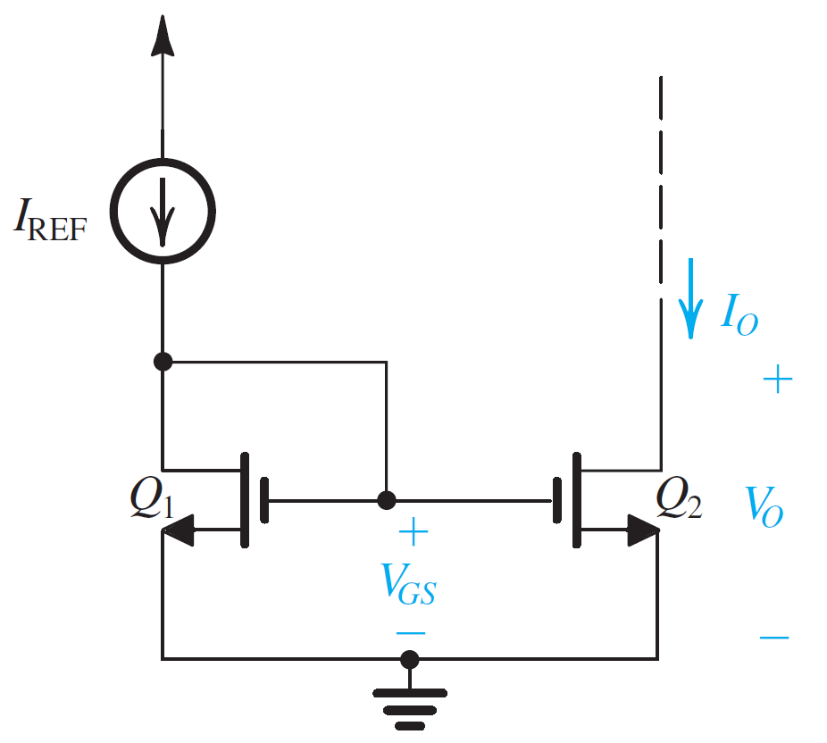
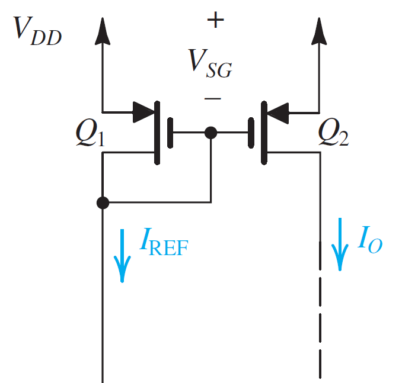
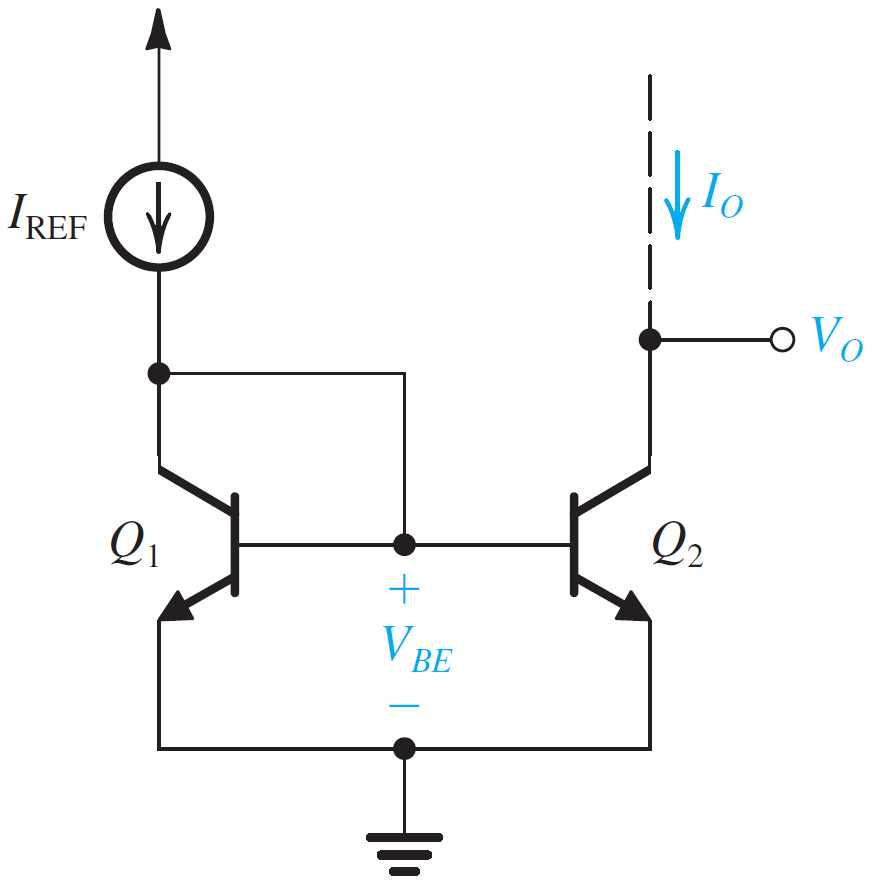
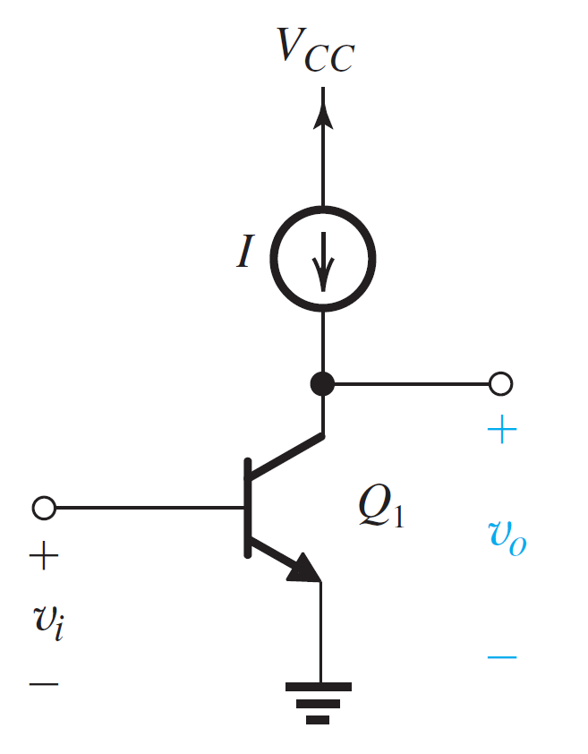
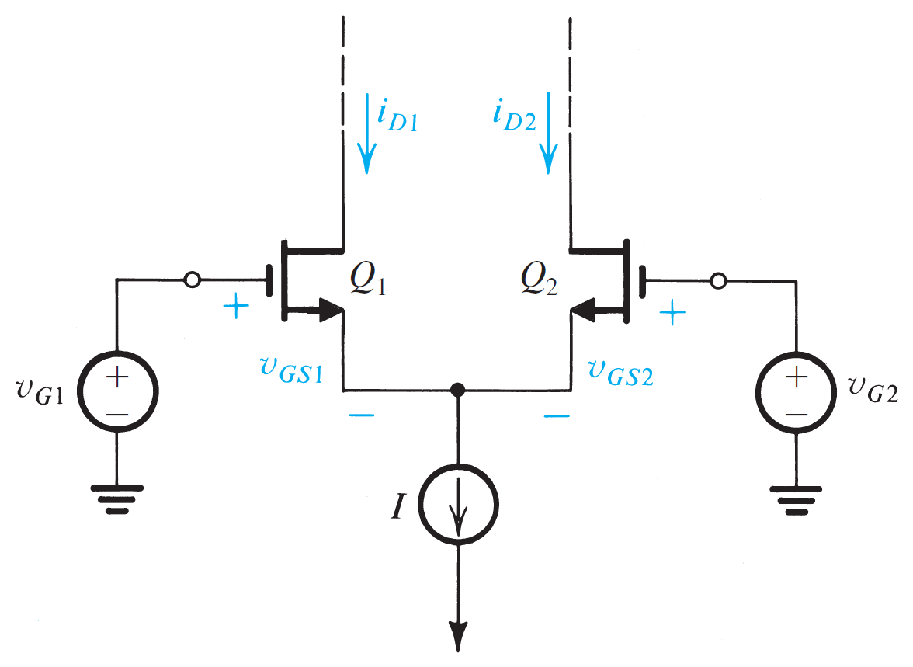
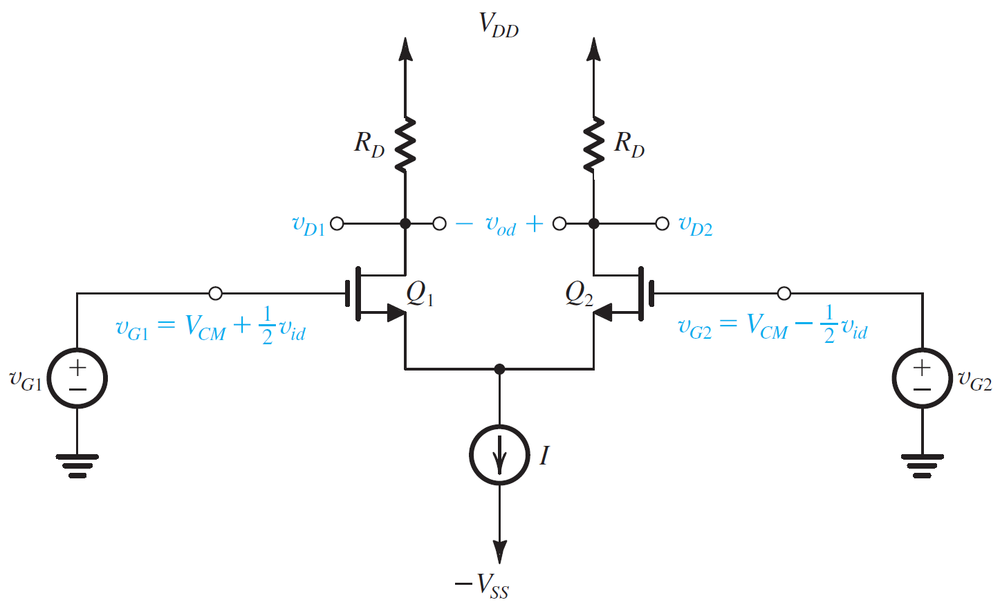
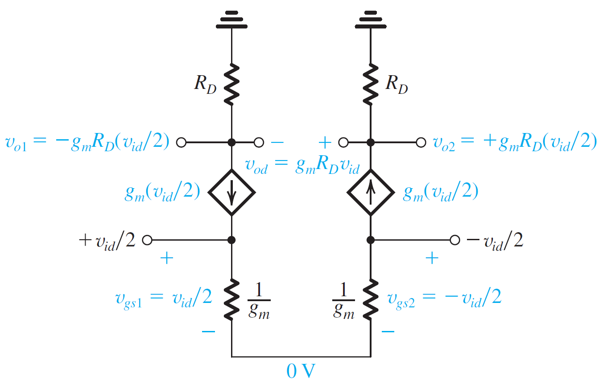
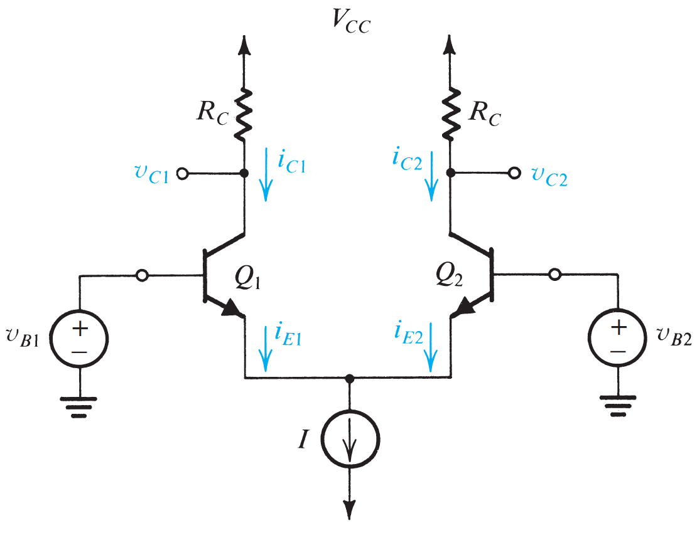
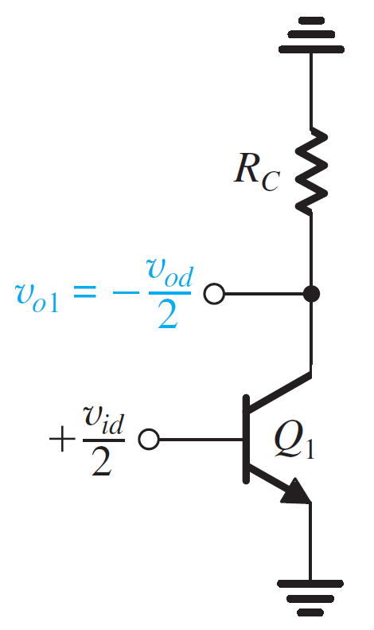

# Integrated Circuit Amplifiers

## NMOS Current Mirror

$$
\Large \frac{I_O}{I_{REF}} = \frac{(W/L)_2}{(W/L)_1}\Bigg(1 + \frac{V_O - V_{GS}}{V_{A2}}\Bigg) \\[30pt]
\Large r_{o2} = \frac{V_A}{I_O}
$$

## PMOS Current Mirror

$$
\Large \frac{I_O}{I_{REF}} = \frac{(W/L)_2}{(W/L)_1}\Bigg(1 + \frac{V_O - V_{GS}}{V_{A2}}\Bigg) \\[30pt]
\Large r_{o2} = \frac{V_A}{I_O}
$$

## NPN BJT Current Mirror

$$
\Large \frac{I_O}{I_{REF}} = \frac{m}{1 + \frac{m + 1}{\beta}}\Bigg(1 + \frac{V_O - V_{BE}}{V_{A2}}\Bigg) \\[30pt]
\Large m = \frac{I_{S2}}{I_{S1}} = \frac{\text{Area of EBJ of }Q_2}{\text{Area of EBJ of }Q_1}\\
\Large r_{o2} = \frac{V_A}{I_O}
$$

## NMOS Current Mirror (Small Signal Analysis)

$$
\Large A_{is} = \frac{g_{m2}}{g_{m1}} = \frac{(W/L)_{2}}{(W/L)_{1}}
$$

## NMOS Gain Cell

$$
\Large r_{o1} = \frac{1}{\lambda_2I_D}, \:\:\:\: r_{02} = \frac{1}{\lambda_2I_D} \\[25pt]
\Large A_v = -g_m (r_{01} || r_{02}) = -\frac{1}{2}g_mr_o \\[15pt]
\Large R_{in} = \infty, \:\:\:\: R_o = r_o = (r_{01} || r_{02})
$$

## NPN BJT Gain Cell

$$
\Large A_v = -g_mr_o \\[15pt]
\Large R_{in} = r_\pi, \:\:\:\: R_o = r_o
$$

## MOS Differential Pair

$$
\Large \text{Assuming } v_{G1} = v_{G2}, \\[15pt]
\Large V_{D1} = V_{D2} = V_{DD} - \frac{I}{2}R_D \\[25pt]
\Large V_{GS1} =  V_{GS2} = \sqrt{\frac{I}{k_n}} + V_t \\[25pt]
\Large V_{G_{max}} = V_{DD} - \frac{I}{2}R_D + V_t
$$

### Operation with Differential Input Voltage

$$
\Large i_{D1} + i_{D2} = I \\[10pt]
\Large \text{Currents } i_{D1} \text{ and } i_{D2} \text{ can be changed by varying } v_{id} \text{:} \\[10pt]
\Large -\sqrt{\frac{2I}{k_n}} \lt v_{id} \lt \sqrt{\frac{2I}{k_n}}
$$

### Large Signal Operation

$$
\Large i_{D1} = \frac{I}{2} + \sqrt{k_nI}\Bigg(\frac{v_{id}}{2}\Bigg) \sqrt{1 - \frac{(v_{id}/2)^2}{I/k_n}} \\[10pt]
\Large i_{D1} = \frac{I}{2} - \sqrt{k_nI}\Bigg(\frac{v_{id}}{2}\Bigg) \sqrt{1 - \frac{(v_{id}/2)^2}{I/k_n}}
$$

### Small Signal Operation

$$
\Large v_{D1} = -g_m R_D \frac{v_{id}}{2} \\[20pt]
\Large v_{D2} = g_m R_D \frac{v_{id}}{2} \\[20pt]
\Large v_{od} = v_{D2} - v_{D1} = g_m R_D v_{id} \\[20pt]
\Large \frac{v_{od}}{v_{id}} = g_m R_D
$$

### Differential Half Circuit

$$
\Large A_d = \frac{v_{od}}{v_{id}} = g_m (R_D || r_o)
$$

## BJT Differential Pair

### Large Signal Operation

$$
\Large I_{E1} = \frac{I}{1 + e^{-v_{id}/V_T}} \\[25pt]
\Large I_{E2} = \frac{I}{1 + e^{v_{id}/V_T}}
$$

### Differential Half Circuit

$$
\Large A_d = \frac{v_{od}}{v_{id}} = g_m R_c
$$
