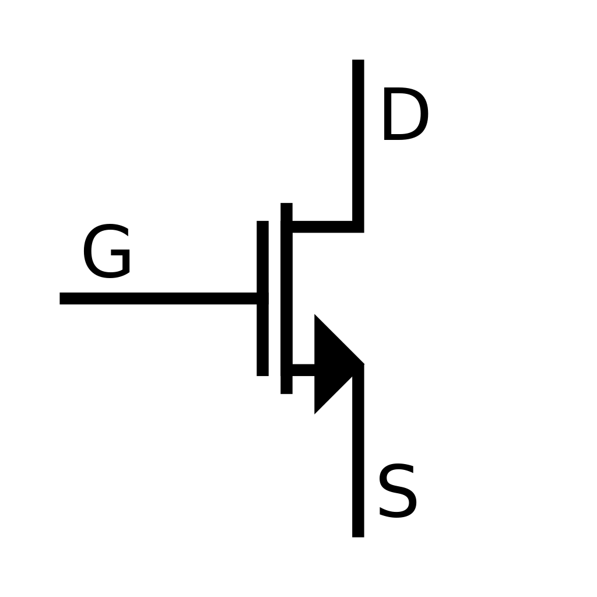
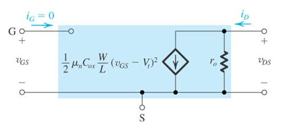
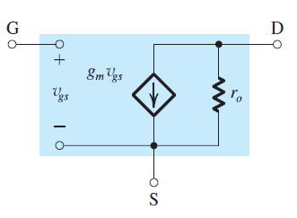
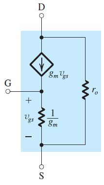
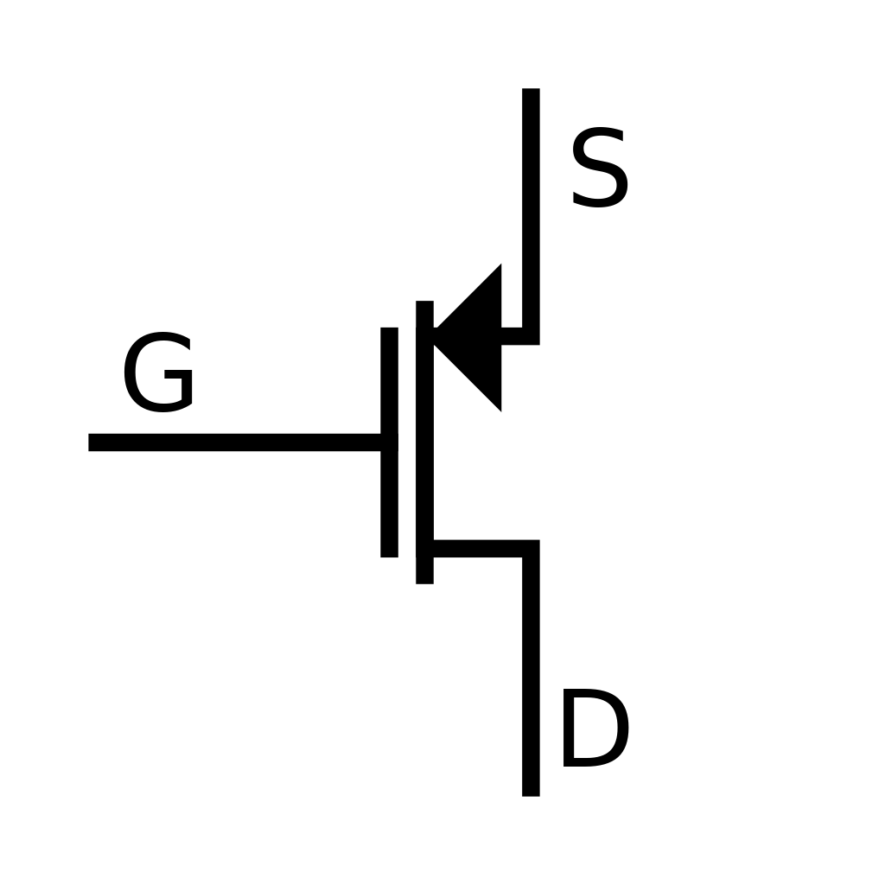
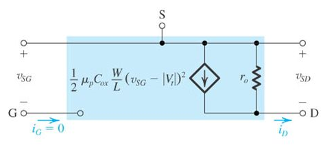

# Metal-Oxide-Semiconductor Field-Effect Transistor (N-Channel)

## Symbol

## Saturation Region

### Conditions:

$$
\huge
V_{GS} \gt V_t \\[15pt]
\huge
V_{DS} \gt V_{GS} - V_t
$$

### Equations:

$$
\huge
I_{DS} = \frac{1}{2}k_nV_{OV}^2 = \frac{1}{2}k_n(V_{GS}-V_t)^2
$$

### Where:

$$
\Large
V_t = \text{threshold voltage} \\[10pt]
\Large
V_{OV} = V_{GS} - V_t \\[10pt]
\Large
k_n = \mu_nC_{ox}\frac{W}{L}
$$

## Triode Region

### Conditions:

$$
\huge
V_{GS} \gt V_t \\[15pt]
\huge
V_{DS} \lt V_{GS} - V_t
$$

### Equations:

$$
\begin{align*}
\huge
I_{DS} &\huge= k_n(V_{OV}-\frac{1}{2}V_{DS})V_{DS}\\
\huge
&\huge= k_n((V_{GS}-V_t)V_{DS}-\frac{1}{2}V_{DS}^2)
\end{align*}
$$

### Where:

$$
\Large
V_t = \text{threshold voltage} \\[10pt]
\Large
V_{OV} = V_{GS} - V_t \\[10pt]
\Large
k_n = \mu_nC_{ox}\frac{W}{L}
$$

## Large Signal Model

## Small Signal Model

# Metal-Oxide-Semiconductor Field-Effect Transistor (P-Channel)

## Symbol

## Saturation Region

### Conditions:

$$
\huge
V_{SG} \gt |V_{tp}| \\[15pt]
\huge
V_{SD} \gt V_{SD} - |V_{tp}|
$$

### Equations:

$$
\huge
I_{DS} = \frac{1}{2}k_n(V_{SG}-V_{tp})^2
$$

### Where:

$$
\Large
V_{tp} = \text{threshold voltage} \\[10pt]
\Large
k_n = \mu_nC_{ox}\frac{W}{L}
$$

## Triode Region

### Conditions:

$$
\huge
V_{SG} \gt V_{tp} \\[15pt]
\huge
V_{SD} \lt V_{SG} - V_{tp}
$$

### Equations:

$$
\huge
I_{DS} = k_n((V_{SG}-V_{tp})V_{SD}-\frac{1}{2}V_{SD}^2)
$$

### Where:

$$
\Large
V_{tp} = \text{threshold voltage} \\[10pt]
\Large
k_n = \mu_nC_{ox}\frac{W}{L}
$$

## Large Signal Model

