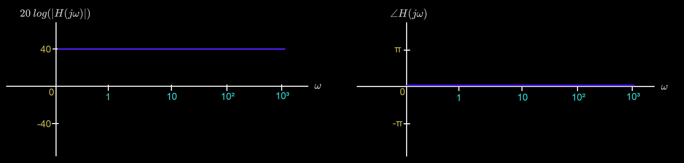

# Bode Form

Consider a transfer function $H(s)$ with real poles and zeros:
$$
\Large H(s) = K\frac{(s+z_1)(s+z_2)...(s+z_m)}{(s+p_1)(s+p_2)...(s+p_n)}
$$
This can be written in **Bode form**:
$$
\Large H(s) = K_0\frac{(\frac{s}{z_1}+1)(\frac{s}{z_2}+1)...(\frac{s}{z_m}+1)}{(\frac{s}{p_1}+1)(\frac{s}{p_2}+1)...(\frac{s}{p_n}+1)}
$$
where $K_0$ is the DC gain,
$$
\Large K_0 = K\frac{z_1z_2...z_m}{p_1p_2...p_n}
$$

# Bode Plots

## Constant

Let $H(s) = K_0$. Then,
$$
\Large 20\:\text{log}|H(j\omega)| = 20\:\text{log}|K_0|
$$

$$
\Large \angle H(j\omega) = \begin{cases} 
      0 & if\:K_0 \gt 0 \\
      \pi & if\:K_0 \lt 0 \\
\end{cases}
$$

### Bode Plot for $\large 10^2$:

$$
\Large 20\:\text{log}|10^2| = 40
$$

$$
\Large \angle 10^2 = 2\angle 10 = 0
$$

### Bode Plot for $\large \frac{1}{10}$:

$$
\Large 20\:\text{log}\Bigg|\frac{1}{10}\Bigg| = -20
$$

$$
\Large \angle \frac{1}{10} = 0
$$

## Zeros & Poles At Origin

Let $H(s) = s^q$. Then,
$$
\Large 20\:\text{log}|H(j\omega)| = 20\:\text{log}|(j\omega)^q| = 20q\:\text{log}|j\omega| = 20q\:\text{log}|\omega|
$$

$$
\Large \angle (j\omega)^q = q\angle j\omega = \frac{\pi}{2}q
$$

###  Bode Plot for $\large s^2$:

$$
\Large 20\:\text{log}|(j\omega)^2| = 40\:\text{log}|\omega|
$$

$$
\Large \angle (j\omega)^2 = \pi
$$

### Bode Plot for $\large s^{-1}$:

$$
\Large 20\:\text{log}|(j\omega)^{-1}| = -20\:\text{log}|\omega|
$$

$$
\Large \angle (jw)^{-1} = -\frac{\pi}{2}
$$

## Real Zeros & Poles

Let $H(s) = (\frac{s}{z}+1)^{\pm1}$. Then,
$$
\Large 20\:\text{log}\Bigg|\Bigg(j\frac{\omega}{z}+1\Bigg)^{\pm1}\Bigg| = \pm20\:\text{log}\Bigg|j\frac{\omega}{z}+1\Bigg| = \pm20\:\text{log}\sqrt{1+\Bigg(\frac{\omega}{z}\Bigg)^2} \\[15pt]
\Large \approx \begin{cases} 
      0 & if\:\omega \lt\!\!\lt z \\[5pt]
      \pm20\:\text{log}(\omega)\pm20\:\text{log}(\frac{1}{z}) & if\:\omega \gt\!\!\gt z
\end{cases}
$$

For convenience, we draw the magnitude as a linear transition of slope $\pm20$ dB/decade starting at $\omega=z$.

$$
\Large \angle\Bigg(j\frac{\omega}{z}+1\Bigg)^{\pm1} = \pm\:tan^{-1}\Bigg(\frac{\omega}{z}\Bigg) \\[15pt]
\Large \approx \begin{cases} 
      0 & if\:\omega \lt\!\!\lt z \\[5pt]
      \pm\frac{\pi}{4}\: & if\:\omega = z \\[5pt]
      \pm\frac{\pi}{2}\: & if\:\omega \gt\!\!\gt z
\end{cases}
$$

For convenience, we draw the phase as a linear transition starting at $\omega=0.1z$ and ending at $\omega=10z$.

### Bode Plot for $\large (\frac{s}{z}+1)$:

$$
\Large 20\:\text{log}\sqrt{1+\Bigg(\frac{\omega}{z}\Bigg)^2} \approx \begin{cases} 
      0 & if\:\omega \lt\!\!\lt z \\[5pt]
      20\:\text{log}(\omega)+20\:\text{log}(\frac{1}{z}) & if\:\omega \gt\!\!\gt z
\end{cases}
$$

$$
\Large \angle\Bigg(j\frac{\omega}{z} + 1\Bigg) \approx \begin{cases} 
      0 & if\:\omega \lt\!\!\lt z \\[5pt]
      \frac{\pi}{4}\: & if\:\omega = z \\[5pt]
      \frac{\pi}{2}\: & if\:\omega \gt\!\!\gt z
\end{cases}
$$

### Bode Plot for $\large (\frac{s}{z} + 1)^{-1}$:

$$
\Large -20\:\text{log}\sqrt{1+\Bigg(\frac{\omega}{z}\Bigg)^2} \approx \begin{cases} 
      0 & if\:\omega \lt\!\!\lt z \\[5pt]
      -20\:\text{log}(\omega)-20\:\text{log}(\frac{1}{z}) & if\:\omega \gt\!\!\gt z
\end{cases}
$$

$$
\Large \angle\Bigg(j\frac{\omega}{z} + 1\Bigg)^{-1} \approx \begin{cases} 
      0 & if\:\omega \lt\!\!\lt z \\[5pt]
      -\frac{\pi}{4}\: & if\:\omega = z \\[5pt]
      -\frac{\pi}{2}\: & if\:\omega \gt\!\!\gt z
\end{cases}
$$

## Complex Zeros & Poles

Let $H(s) = ((\frac{s}{\omega_n})^2+2\zeta(\frac{s}{\omega_n})+1)^{\pm1}$. Then,
$$
\Large 20\:\text{log}\Bigg|\Bigg(\Bigg(\frac{j\omega}{\omega_n}\Bigg)^2+2\zeta\Bigg(\frac{\omega}{\omega_n}\Bigg)j+1\Bigg)^{\pm1}\Bigg| = \pm20\:\text{log}\sqrt{\Bigg(1-\Bigg(\frac{\omega}{\omega_n}^2\Bigg)^2\Bigg)+4\zeta^2\Bigg(\frac{\omega}{\omega_n}\Bigg)^2}\\[15pt]
\Large \approx \begin{cases} 
      0 & if\:\omega \lt\!\!\lt \omega_n \\[5pt]
      \pm40\:\text{log}(\omega)\mp40\:\text{log}(\omega_n) & if\:\omega \gt\!\!\gt \omega_n
\end{cases}
$$

For convenience, we draw the magnitude as a linear transition of slope $\pm40$ dB/decade starting at $\omega=\omega_n$.

$$
\Large \angle \Bigg(\Bigg(\frac{j\omega}{\omega_n}\Bigg)^2+2\zeta\Bigg(\frac{\omega}{\omega_n}\Bigg)j+1\Bigg)^{\pm1} = \pm tan^{-1}\Bigg(\frac{2\zeta\frac{\omega}{\omega_n}}{1-(\frac{\omega}{\omega_n})^2}\Bigg) \\[15pt]
\Large \approx \begin{cases} 
      0 & if\:\omega \lt\!\!\lt \omega_n \\[5pt]
      \pm\frac{\pi}{2}\: & if\:\omega = \omega_n \\[5pt]
      \pm\pi\: & if\:\omega \gt\!\!\gt \omega_n
\end{cases}
$$

### Bode Plot for $\large ((\frac{s}{\omega_n})^2+2\zeta(\frac{s}{\omega_n})+1)$:

$$
\Large 20\:\text{log}\Bigg|\Bigg(\frac{j\omega}{\omega_n}\Bigg)^2+2\zeta\Bigg(\frac{\omega}{\omega_n}\Bigg)j+1\Bigg| \approx \begin{cases} 
      0 & if\:\omega \lt\!\!\lt \omega_n \\[5pt]
      40\:\text{log}(\omega)-40\:\text{log}(\omega_n) & if\:\omega \gt\!\!\gt \omega_n
\end{cases}
$$

$$
\Large \angle \Bigg(\Bigg(\frac{j\omega}{\omega_n}\Bigg)^2+2\zeta\Bigg(\frac{\omega}{\omega_n}\Bigg)j+1 \Bigg) = tan^{-1}\Bigg(\frac{2\zeta\frac{\omega}{\omega_n}}{1-(\frac{\omega}{\omega_n})^2}\Bigg) \\[15pt]
\Large \approx \begin{cases} 
      0 & if\:\omega \lt\!\!\lt \omega_n \\[5pt]
      \frac{\pi}{2}\: & if\:\omega = \omega_n \\[5pt]
      \pi\: & if\:\omega \gt\!\!\gt \omega_n
\end{cases}
$$

### Bode Plot for $\large ((\frac{s}{\omega_n})^2+2\zeta(\frac{s}{\omega_n})+1)^{-1}$:

$$
\Large 20\:\text{log}\Bigg|\Bigg(\Bigg(\frac{j\omega}{\omega_n}\Bigg)^2+2\zeta\Bigg(\frac{\omega}{\omega_n}\Bigg)j+1\Bigg)^{-1}\Bigg| \approx \begin{cases} 
      0 & if\:\omega \lt\!\!\lt \omega_n \\[5pt]
      -40\:\text{log}(\omega)+40\:\text{log}(\omega_n) & if\:\omega \gt\!\!\gt \omega_n
\end{cases}
$$

$$
\Large \angle \Bigg(\Bigg(\frac{j\omega}{\omega_n}\Bigg)^2+2\zeta\Bigg(\frac{\omega}{\omega_n}\Bigg)j+1 \Bigg)^{-1} = -tan^{-1}\Bigg(\frac{2\zeta\frac{\omega}{\omega_n}}{1-(\frac{\omega}{\omega_n})^2}\Bigg) \\[15pt]
\Large \approx \begin{cases} 
      0 & if\:\omega \lt\!\!\lt \omega_n \\[5pt]
      -\frac{\pi}{2}\: & if\:\omega = \omega_n \\[5pt]
      -\pi\: & if\:\omega \gt\!\!\gt \omega_n
\end{cases}
$$

