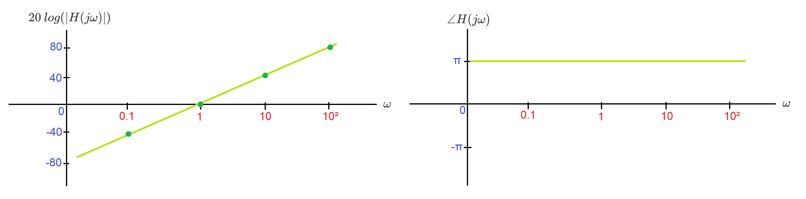
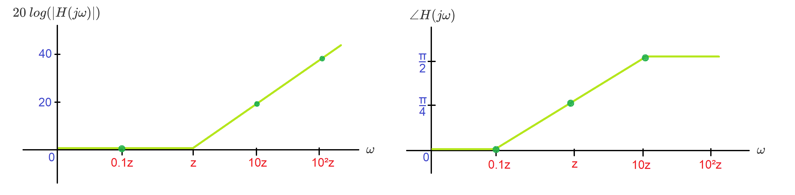

# Bode Plots

## Bode Form

Consider a transfer function $H(s)$ with real poles and zeros:
$$
H(s) = K\frac{(s+z_1)(s+z_2)...(s+z_m)}{(s+p_1)(s+p_2)...(s+p_n)}
$$
This can be written in **Bode form**:
$$
H(s) = K_0\frac{(\frac{s}{z_1}+1)(\frac{s}{z_2}+1)...(\frac{s}{z_m}+1)}{(\frac{s}{p_1}+1)(\frac{s}{p_2}+1)...(\frac{s}{p_n}+1)}
$$
where $K_0$ is the DC gain,
$$
K_0 = K\frac{z_1z_2...z_m}{p_1p_2...p_n}
$$

## Bode Plots

### Constant

Let $H(s) = K_0$. Then,
$$
20\:log|H(j\omega)| = 20\:log|K_0|
$$

$$
\angle H(j\omega) = \begin{cases} 
      0 & if\:K_0 \gt 0 \\
      \pi & if\:K_0 \lt 0 \\
\end{cases}
$$

#### Example: Bode Plot for $\frac{1}{10}$:

$$
20\:log(\frac{1}{10}) = -20
$$

$$
\angle \frac{1}{10} = 0
$$

Bode plot:

### Zeros & Poles at origin

Let $H(s) = s^q$. Then,
$$
20\:log|H(j\omega)| = 20q\:log|j\omega| = 20q\:log|\omega|
$$

$$
\angle (j\omega)^q = q\angle j\omega = q\frac{\pi}{2}
$$

#### Example: Bode Plot for $s^2$:

$$
20\:log|(j\omega)^2| = 40\:log|\omega|
$$

$$
\angle (j\omega)^2 = \pi
$$

### Real Zeros & Poles

Let $H(s) = (\frac{s}{z}+1)^{\pm1}$. Then,
$$
20\:log|(j\frac{\omega}{z}+1)^{\pm1}| = \pm20\:log|j\frac{\omega}{z}+1| = \pm20\:log\sqrt{1+(\frac{\omega}{z})^2} \\[15pt]
\approx \begin{cases} 
      0 & if\:\omega \lt\!\!\lt z \\[5pt]
      \pm20\:log(\omega)\pm20\:log(\frac{1}{z}) & if\:\omega \gt\!\!\gt z
\end{cases}
$$

For convenience, we draw the magnitude as a linear transition of slope $\pm20$ dB/decade starting at $\omega=z$.

$$
\angle(j\frac{\omega}{z}+1)^{\pm1} = \pm\:tan^{-1}(\frac{\omega}{z}) \\[15pt]
\approx \begin{cases} 
      0 & if\:\omega \lt\!\!\lt z \\[5pt]
      \pm\frac{\pi}{4}\: & if\:\omega = z \\[5pt]
      \pm\frac{\pi}{2}\: & if\:\omega \gt\!\!\gt z
\end{cases}
$$

For convenience, we draw the phase as a linear transition starting at $\omega=0.1z$ and ending at $\omega=10z$.

#### Example: Bode Plot for $(\frac{s}{z}+1)$:

$$
20\:log\sqrt{1+(\frac{\omega}{z})^2} \approx \begin{cases} 
      0 & if\:\omega \lt\!\!\lt z \\[5pt]
      20q\:log(\omega)+20q\:log(\frac{1}{z}) & if\:\omega \gt\!\!\gt z
\end{cases}
$$

$$
\angle(j\frac{\omega}{z} + 1) \approx \begin{cases} 
      0 & if\:\omega \lt\!\!\lt z \\[5pt]
      \frac{\pi}{4}\: & if\:\omega = z \\[5pt]
      \frac{\pi}{2}\: & if\:\omega \gt\!\!\gt z
\end{cases}
$$

### Complex Zeros & Poles

Let $H(s) = ((\frac{s}{\omega_n})^2+2\zeta(\frac{s}{\omega_n})+1)^{\pm1}$. Then,
$$
20\:log|((\frac{j\omega}{\omega_n})^2+2\zeta(\frac{\omega}{\omega_n})j+1)^{\pm1}| = \pm20\:log\sqrt{(1-(\frac{\omega}{\omega_n}^2)^2)+4\zeta^2(\frac{\omega}{\omega_n})^2}\\[15pt]
\approx \begin{cases} 
      0 & if\:\omega \lt\!\!\lt \omega_n \\[5pt]
      \pm40\:log(\omega)\mp40\:log(\omega_n) & if\:\omega \gt\!\!\gt \omega_n
\end{cases}
$$

For convenience, we draw the magnitude as a linear transition of slope $\pm40$ dB/decade starting at $\omega=$\omega_n.

$$
\angle ((\frac{j\omega}{\omega_n})^2+2\zeta(\frac{\omega}{\omega_n})j+1)^{\pm1} = \pm tan^{-1}(\frac{2\zeta\frac{\omega}{\omega_n}}{1-(\frac{\omega}{\omega_n})^2}) \\[15pt]
\angle(j\frac{\omega}{z} + 1) \approx \begin{cases} 
      0 & if\:\omega \lt\!\!\lt \omega_n \\[5pt]
      \pm\frac{\pi}{2}\: & if\:\omega = \omega_n \\[5pt]
      \pm\pi\: & if\:\omega \gt\!\!\gt \omega_n
\end{cases}
$$

#### Example: Bode Plot for $((\frac{s}{\omega_n})^2+2\zeta(\frac{s}{\omega_n})+1)$

$$
20\:log|(\frac{j\omega}{\omega_n})^2+2\zeta(\frac{\omega}{\omega_n})j+1| \approx \begin{cases} 
      0 & if\:\omega \lt\!\!\lt \omega_n \\[5pt]
      40\:log(\omega)-40\:log(\omega_n) & if\:\omega \gt\!\!\gt \omega_n
\end{cases}
$$

$$
\angle (\frac{j\omega}{\omega_n})^2+2\zeta(\frac{\omega}{\omega_n})j+1 = tan^{-1}(\frac{2\zeta\frac{\omega}{\omega_n}}{1-(\frac{\omega}{\omega_n})^2}) \\[15pt]
\angle(j\frac{\omega}{z} + 1) \approx \begin{cases} 
      0 & if\:\omega \lt\!\!\lt \omega_n \\[5pt]
      \frac{\pi}{2}\: & if\:\omega = \omega_n \\[5pt]
      \pi\: & if\:\omega \gt\!\!\gt \omega_n
\end{cases}
$$

