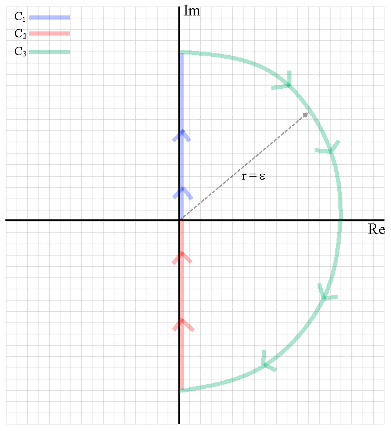

# Nyquist Plots

## Principle of the Argument

Consider a simple closed contour $\large C$ and a transfer function $\large H(s)$.

Then, $\large H(C)$ will encircle the origin in a clockwise direction $\large Z - P$ times, where

- $\large Z = $ number of zeros of $\large H(s)$ inside $\large C$
- $\large P = $ number of poles of $\large H(s)$ inside $\large C$

Assumption: the contour $\large C$ does not pass through any poles or zeros.

## Definition

Consider a unity feedback system with reference signal $r(t)$, output signal $y(t)$, plant $P(s)$ and controller $C(s)$.

If we define $L(s)$ such that,
$$
\Large L(s) = P(s)C(s) = \frac{N(s)}{D(s)}
$$
Then,
$$
\Large T_{ry}(s) = \frac{L(s)}{1 + L(s)}
$$
where the closed loop poles are solutions to $\large 1 + L(s) = 0$.

Define $\large H(s) = 1 + L(s)$. Letting $\large L(s) = \frac{N(s)}{D(s)}$:
$$
\Large H(s) = 1 + \frac{N(s)}{D(s)} = \frac{D(s) + N(s)}{D(s)}
$$
This shows that poles of $\large H(s)$ are poles of $\large L(s)$ (open-loop poles) and zeros of $\large H(s)$ are poles of $\large T_{ry}(s)$ (closed-loop poles)

Define a contour C such that:

1. $\large C_1$: all points $\large s = j\omega$ as $\large \omega$ ranges from $\large 0$ to $\large \infty$
2. $\large C_2$: all points $\large s = -j\omega$ as $\large \omega$ ranges from $\large \infty$ to $\large 0$
3. $\large C_3$: semicircle of infinite radius, $\large s = \epsilon e^{j \theta}$, where $\large \epsilon \to \infty$,  and $\large \theta$ goes from $\large 90^{\circ}$ to $\large -90^{\circ}$

$\large H(C)$ is called the **Nyquist plot** of $\large H(C)$.

Principle of the Argument:
$$
\Large N = Z - P
$$
where

- $\large N = $ number of times the Nyquist plot encircles the origin
- $\large Z = $ number of zeros of $\large H(s)$ enclosed by $\large C$,
i.e., number of closed-loop poles in RHP
- $\large P = $ number of poles of $\large H(s)$ enclosed by $\large C$,
i.e., number of open-loop poles in RHP

Nyquist plot can also be generated for $\large L(s)$, where $\large N =$ number of times the Nyquist plot encircles $\large s = -1$ (since $\large H(s) = 1 + L(s)$)

## Drawing Nyquist Plots

### Contour $C_1$

Contour $\large C_1$ consists of points $\large s = j \omega$ where $\large \omega$ ranges from $\large 0$ to $\large \infty$. Therefore, each point on $\large L(C_1)$ is just a complex number $\large L(j \omega)$ with magnitude $\large |L(j \omega)|$ and phase $\large \angle L(j \omega)$.

**$\large C_1$ can be traced out by looking at the variation of the Bode plot of $\large L(j \omega)$.**

### Contour $C_2$

Contour $\large C_2$ consists of points $\large s = -j \omega$ where $\large \omega$ ranges from $\large \infty$ to $\large 0$. Therefore, each point on $\large L(C_2)$ is just a complex number $\large L(-j \omega)$ with magnitude $\large |L(-j \omega)|$ and phase $\large \angle L(-j \omega)$. In other words, it is the complex conjugate of $\large L(-j \omega)$.

**$\large L(C_2)$ is the mirror of $\large L(C_1)$ about the real axis.**

### Contour $C_3$

Contour $\large C_3$ consists of points in the semicircle  $\large s = \epsilon e^{j \theta}$, where $\large \epsilon \to \infty$,  and $\large \theta$ goes from $\large 90^{\circ}$ to $\large -90^{\circ}$. $\large L(C_3)$ contains points of the form $\large L(\epsilon e^{j \theta})$. Since $\large \epsilon$ is infinite, the term in $\large L(\epsilon e^{j \theta})$ with the highest power of $\large \epsilon$ will dominate.

**If $\large L(s)$ is strictly proper, $\large L(C_3) = 0$.**

**If $\large L(s)$ is proper, (but not strictly proper), $\large L(C_3)$ is a constant**

## Stability Margins

We can determine the stability margins using the Nyquist plot.

**Gain Margin** is the gain required to make the Nyquist plot intersect the negative real axis at -1. In other words, the length from the origin to the point where the Nyquist plot intersects the negative real axis is $\large \frac{1}{GM}$.

**Phase Margin** is the angle between the point where the Nyquist plot enters the unit circle and the -1 point about the origin.

