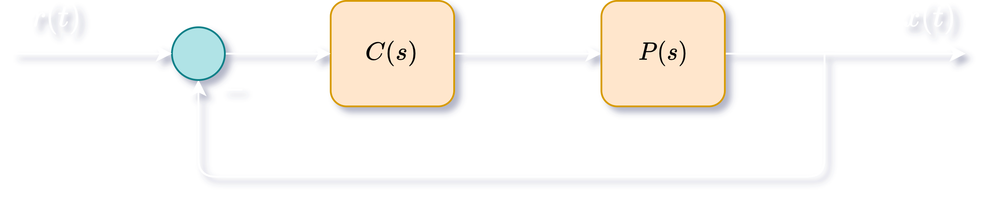

# Reference Tracking

Consider a unity feedback system with reference signal $r(t)$, output signal $y(t)$, plant $P(s)$ and controller $C(s)$.

The transfer function from $r$ to $y$ is:
$$
\Large T_{ry}(s) = \frac{Y(s)}{R(s)} = \frac{P(s)C(s)}{1+P(s)C(s)}
$$
We can write $P(s)C(S)$ as:
$$
\Large P(s)C(s) = \frac{a(s)}{s^q b(s)}
$$
where $s = 0$ is not a root of $b(s)$.

For a reference signal of the form,
$$
\Large r(t) = kt^m \implies R(s) = \frac{km!}{s^{m+1}}
$$
where k is a constant and m is a non-negative integer, we can assess the error function $e(t) = r(t) - y(t)$:
$$
\Large \begin{align*}
e(t) &= r(t) - y(t) \\[15pt]
E(s) &= R(s) - Y(s) \\[15pt]
&= R(s) - P(s)C(s)E(s) \\[15pt]
E(s) &= \frac{1}{1 + P(s)C(s)}R(s) \\[15pt]
&= km!\frac{b(s)}{(s^qb(s) + a(s))s^{m-q+1}} \\[15pt]
sE(s) &= km!\frac{b(s)}{(s^qb(s) + a(s))s^{m-q}} \\[15pt]
\end{align*}
$$
We know,
$$
\Large e_{ss}(t) = \lim\limits_{x \to \infty} e(t) = \lim\limits_{s \to 0} sE(s)
$$
There value of $e_{ss}(t)$ affects the tracking of the reference signal and depends on the relative values of $q$ and $m$.

Case | Condition | $\large e_{ss}(t)$
-- | --
Perfect Tracking | $\Large q > m$ | 0
Constant Tracking | $\Large q = m$ | $\Large \lim\limits_{s \to 0} km! \frac{b(s)}{s^q + a(s)}$
No Tracking | $\Large q > m$ | $\Large \infty$