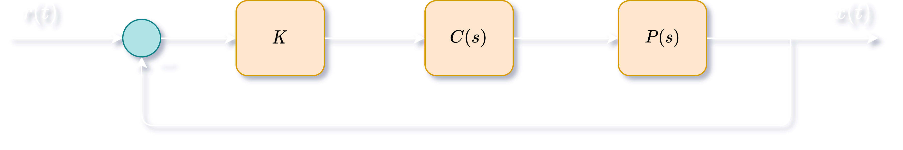

# Root Locus

Consider a unity feedback system with reference signal $r(t)$, output signal $y(t)$, plant $P(s)$ and controller $C(s)$.

If we define $L(s)$ such that,
$$
\Large L(s) = P(s)C(s) = \frac{N(s)}{D(s)}
$$

Then, transfer function from $r$ to $y$ becomes:
$$
\Large T_{ry}(s) = \frac{Y(s)}{R(s)} = \frac{KP(s)C(s)}{1+KP(s)C(s)} = \frac{KL(s)}{1+KL(s)} = \frac{KN(s)}{D(s)+KN(s)}
$$
Thus the system is stable if and only if,
$$
\Large L(s) = -\frac{1}{K}
$$

## Rules for Plotting Positive Root Locus

### The positive root locus is the set of all points $s$ in the complex plane for which $\angle L(s) = (2l + 1)\pi$ radians (where $l$ is an integer).

### Rule 1.

The $n$ branches begin at the open loop poles (when $K = 0$). Of the $n$ branches, $m$ end at the open loop zeros (when $K = \infty$).

### Rule 2.

The positive root locus contains all points on the real axis that are to the **left of an odd number of zeros and poles.**

### Rule 3.

Of the $n$ branches in root locus, $n - m$ branches go to infinity, and asymptotically approach lines coming out of the point $s = \alpha$ with angles $\Phi_l$, where
$$
\Large \alpha = \frac{\sum\:\text{open loop poles} - \sum\:\text{open loop zeros}}{n - m}, \:\: \Phi_l = \frac{(2l + 1)\pi}{n - m}
$$
for $l = 0, 1, 2, ..., n - m - 1$.

### Rule 4.

The root locus will have multiple roots at $\bar{s}$ if the following are satisfied:
$$
\Large N(\bar{s})\frac{dD}{ds}(\bar{s}) - D(\bar{s})\frac{dN}{ds}(\bar{s}) = 0 \\[15pt]
\text{AND} \\[15pt]
\Large -\frac{D(\bar{s})}{N(\bar{s})} = K \in \mathbb{R}^+
$$

At a particular point $\bar{s}$ on the positive root locus,
$$
\Large K = \frac{1}{L(s)} = \frac{|\bar{s} + p_1||\bar{s} + p_2|...|\bar{s} + p_n|}{|\bar{s} + z_1||\bar{s} + z_2|...|\bar{s} + z_m|}
$$
where $p_1, p_2,...,p_n$ and $z_1, z_2,...,z_m$ are the zeros and poles respectively.

## Rules for Plotting Negative Root Locus

### The positive root locus is the set of all points $s$ in the complex plane for which $\angle L(s) = 2l\pi$ radians (where $l$ is an integer).

### Rule 1.

The $n$ branches begin at the open loop poles (when $K = 0$). Of the $n$ branches, $m$ end at the open loop zeros (when $K = -\infty$).

### Rule 2.

The positive root locus contains all points on the real axis that are to the **left of an even number of zeros and poles.**

### Rule 3.

Of the $n$ branches in root locus, $n - m$ branches go to infinity, and asymptotically approach lines coming out of the point $s = \alpha$ with angles $\Phi_l$, where
$$
\Large \alpha = \frac{\sum\:\text{open loop poles} - \sum\:\text{open loop zeros}}{n - m}, \:\: \Phi_l = \frac{2l\pi}{n - m}
$$
for $l = 0, 1, 2, ..., n - m - 1$.

### Rule 4.

The root locus will have multiple roots at $\bar{s}$ if the following are satisfied:
$$
\Large N(\bar{s})\frac{dD}{ds}(\bar{s}) - D(\bar{s})\frac{dN}{ds}(\bar{s}) = 0 \\[15pt]
\text{AND} \\[15pt]
\Large -\frac{D(\bar{s})}{N(\bar{s})} = K \in \mathbb{R}^-
$$
At a particular point $\bar{s}$ on the negative root locus,
$$
\Large K = -\frac{1}{L(s)} = -\frac{|\bar{s} + p_1||\bar{s} + p_2|...|\bar{s} + p_n|}{|\bar{s} + z_1||\bar{s} + z_2|...|\bar{s} + z_m|}
$$
where $p_1, p_2,...,p_n$ and $z_1, z_2,...,z_m$ are the zeros and poles respectively.

NOTE: The root locus is always **symmetric about the real axis** provided all coefficients of $N(s)$ and $D(s)$ are real.