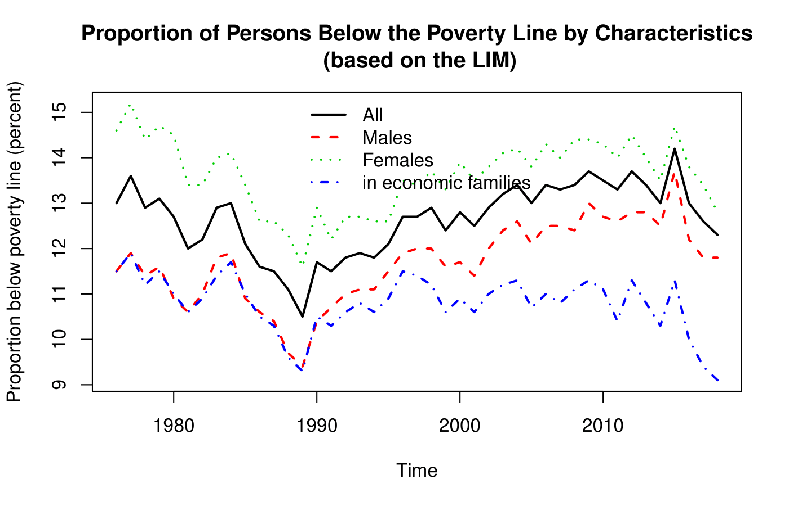
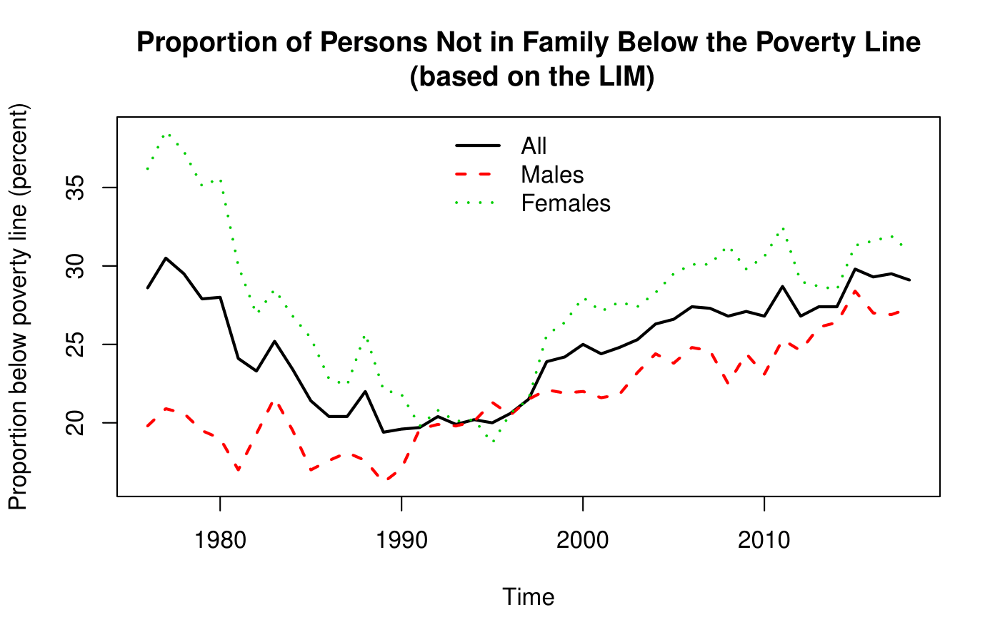

# Inequality

## The Gini Coefficient

$$
\Large \text{Gini Coefficient} = \frac{n - 1}{n} - \frac{2}{n}\sum\limits^{n - 1}_{i = 1}s_i
$$

where $\large n$ is the number of groups sorted by income and $\large s_i$ is the cumulative income share of the groups $\large 1$ to $\large i$.

## Measure of Poverty

### The Market Basket Measure

The Market Basket Measure (MBM) is based on the cost of a specific basket of goods and services representing a modest, basic standard of living. It includes the costs of food, clothing, shelter, transportation and other items for a reference family. These costs are compared to the disposable income of families to determine whether or not they fall below the poverty line.

### The Low Income Measure

The Low Income Measure (LIM) defines the poverty line at half the adjusted median household income.

## Source of Inequality

- Skills
- How skills are valued
- Education
- Technological advances
- Value of education

## Poverty in Canada

- The overall conclusion is that poverty has decreased from 1976 to 1990 and increased after 1990
- If we compare the situations of males and females, we can see that the proportion of females below the poverty line has been systematically higher than the proportion of males throughout the period