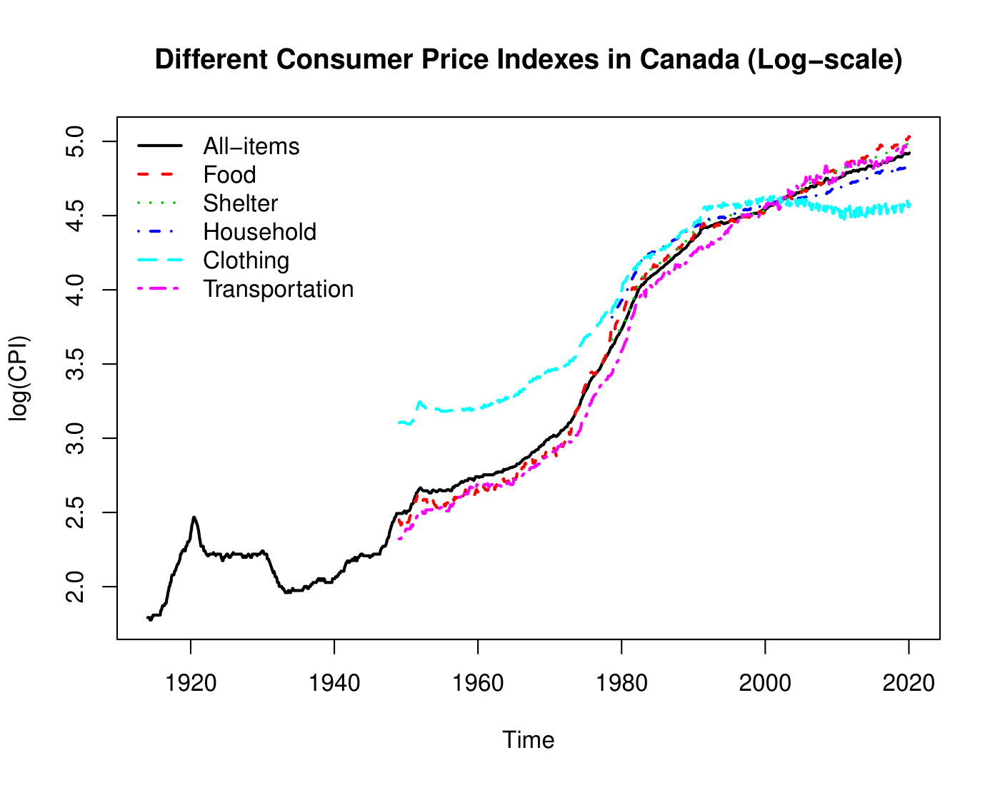
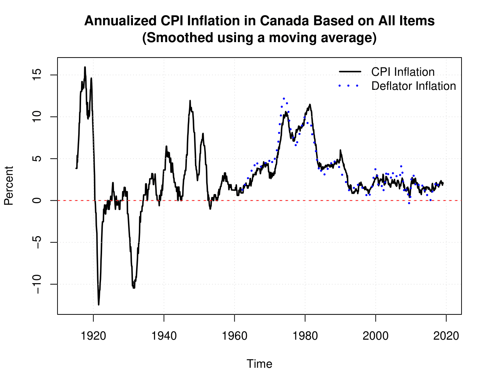

# Inflation Rates

Inflation is defined as the general and persistent growth in the price level. It can be found by calculating the growth rate of the CPI.
$$
\Large \text{Inflation Rate}, \pi_t = \frac{CPI_t - CPI_{t - 1}}{CPI_{t - 1}} \times 100
$$

## Nominal and Real Interest Rates

$$
\Large r = \frac{1 + i}{1 + \pi} - 1 \approx i - \pi
$$

where $\large r$ is the real interest rate, $\large i$ is the nominal interest rate and $\large \pi$ is the inflation rate.

## Inflation Rates in Canada

- Inflation was very higher during the First World War
- Following the end of the First World War, inflation decreased and became negative for more than 1 year. It is the first period of deflation that Canada experienced in our sample.
- Canada experienced a second period of deflation that lasted more than a year after the Great Depression of 1929
- Another period of high inflation happened around the Korean War (1950-1953).
- The last period of high inflation happened between 1973 (oil price crisis) and the end of the 1982 recession.