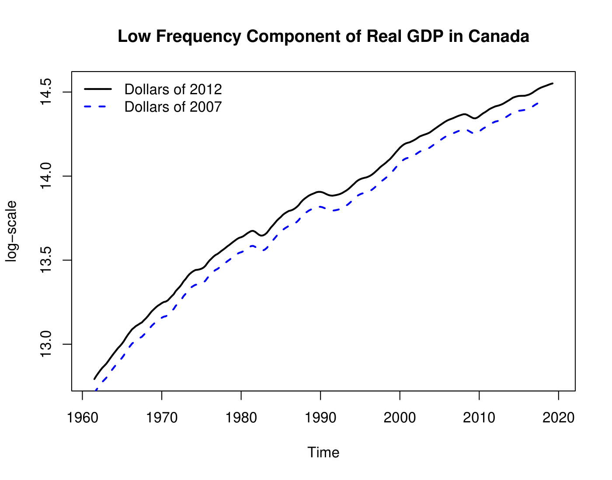
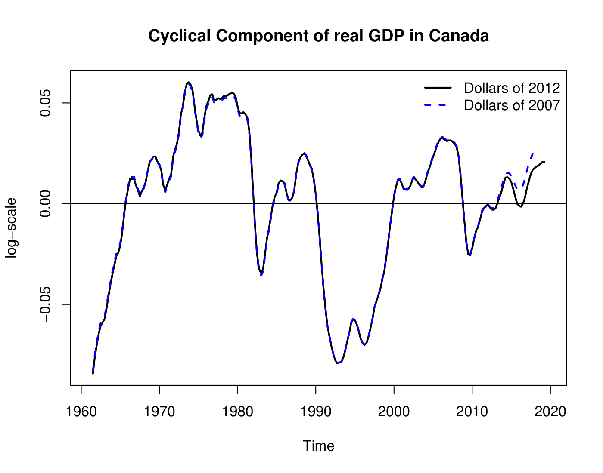
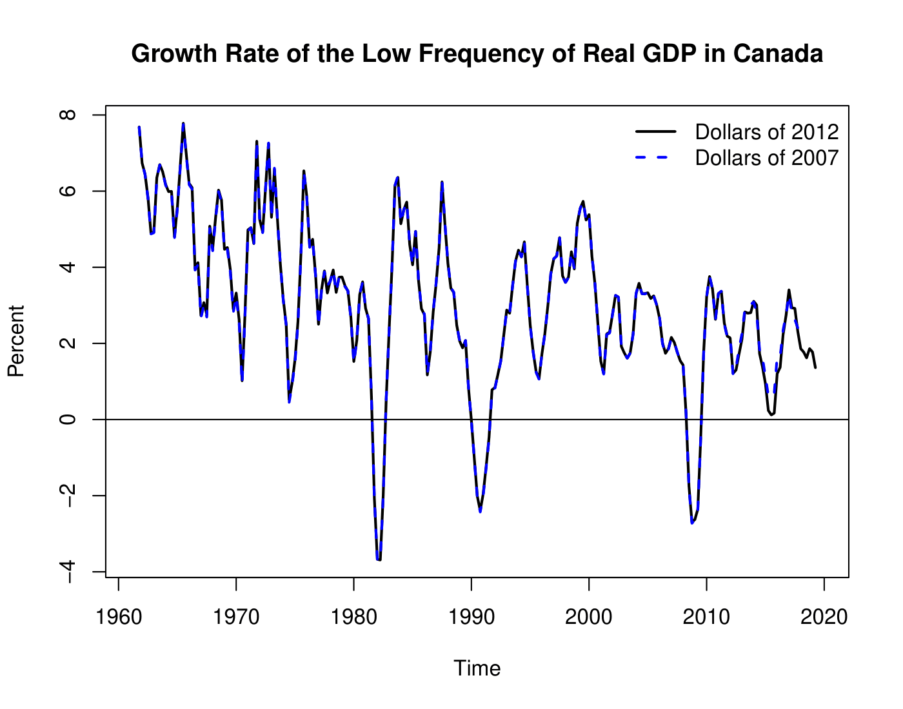
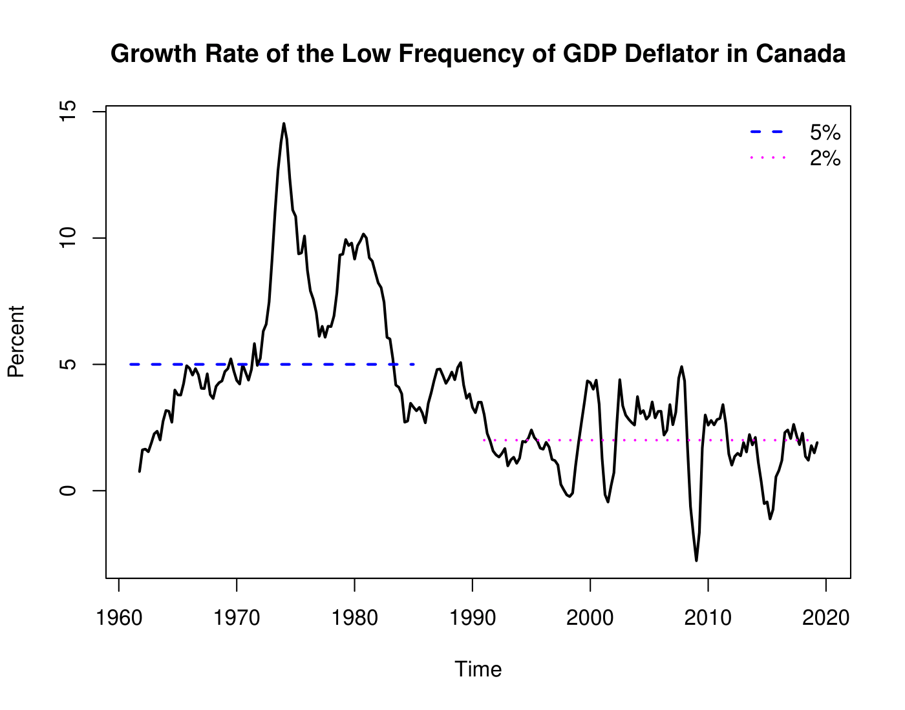

# Real GDP

Real GDP can be calculated using either price or quantity indexes.

### Using Quantity Indexes

$$
\Large \text{Real GDP} = \text{Nominal GDP}_{base\:year} \times \frac{\text{CPI}_{current\:year}}{\text{CPI}_{base\:year}}
$$

### Using Price Indexes (The Deflation Approach)

$$
\Large \text{Real GDP} = \frac{\text{Nominal GDP}_{current\:year}}{\text{Price Index}_{current\:year}}
$$

## Real GDP in Canada

- The real GDP in dollars of 2012 (solid black line) is higher than real GDP in dollars of 2007 (blue dashed line) simply because most prices were higher in 2012
- The cyclical component of real GDP is almost exactly identical between 2007 and 2012
- Since we used the log-scale in the above graph, it is easy to conclude that the growth rate of real GDP has been decreasing between 1961 and 2020

- The growth rates of the low frequency component are also nearly identical between 2007 and 2012

