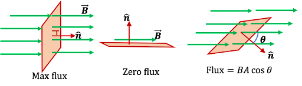
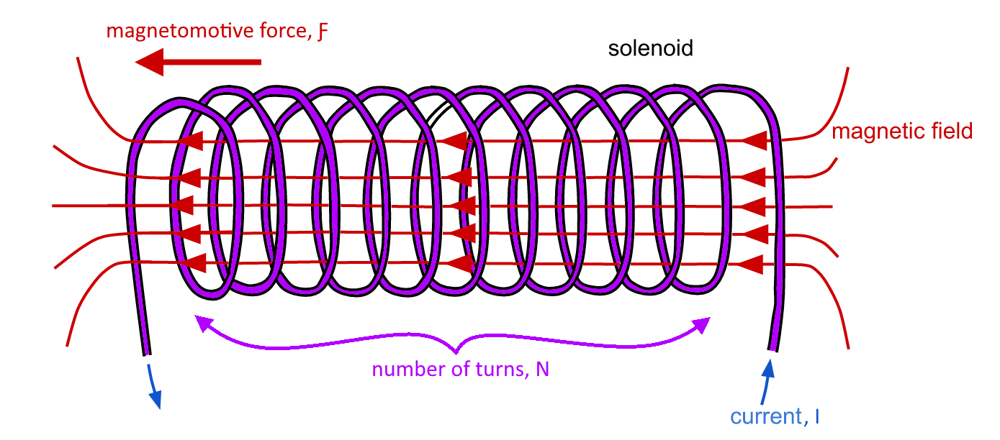

# Magnetic Circuits

## Magnetic Flux $\Phi$

**Magnetic flux** $\large \Phi$ (measured in $\large Wb$) is a measurement of the number of magnetic field lines passing through a surface.

## Magnetic Flux Density $B$

**Magnetic flux density** $\large B$ (measured in $\large Wb/m^2$ or $\large T$) is a measurement of the number of magnetic field lines passing through a perpendicular unit area.
$$
\Large \Phi = BA \: cos \: \theta = B_\bot A
$$
where $\large A$ is the area and $\large \theta$ is the angle between the field lines and the surface.

## Magnetomotive Force $\mathcal{F}$

**Magnetomotive Force** $\large \mathcal{F}$ (measured in $\large At$) is a measurement of the ability of a coil to produce flux.
$$
\Large \mathcal{F} = NI
$$
where $\large N$ is the number of turns on the coil and $\large I$ is the current passing through the coil.

## Permeability $\mu$

**Permeability** $\large \mu$ (measured in $\large H/m$) is the ability of a magnetic material to support magnetic field development.
$$
\Large \mu = \mu_r \mu_0 \\
\Large \mu_0 = 4\pi \times 10^{-7} H/m
$$

## Reluctance $\mathcal{R}$

**Reluctance** $\mathcal{R}$ (measured in $\large At/Wb$) is the obstruction offered by a magnetic circuit to the magnetic flux.
$$
\Large \mathcal{R} = \frac{l}{\mu A}
$$
where $\large l$ is the average length of magnetic path, $\large A$ is the cross-sectional area of that path, and $\large \mu$ is the permeability of the magnetic material.

## Ohm's Law for Magnetic Circuits

**Ohm's law for magnetic circuits** outlines the following relation ship between the magnetomotive force $\large \mathcal{F}$, the magnetic flux density $\large \Phi$ and the reluctance $\large \mathcal{R}$:
$$
\Large \mathcal{F} = NI = \Phi \mathcal{R}
$$