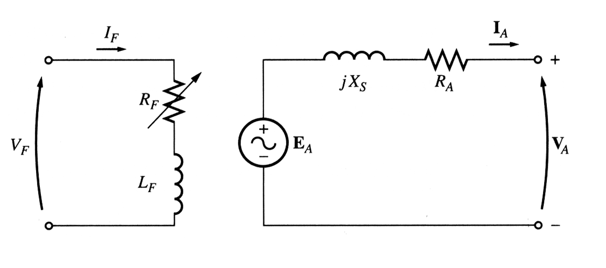
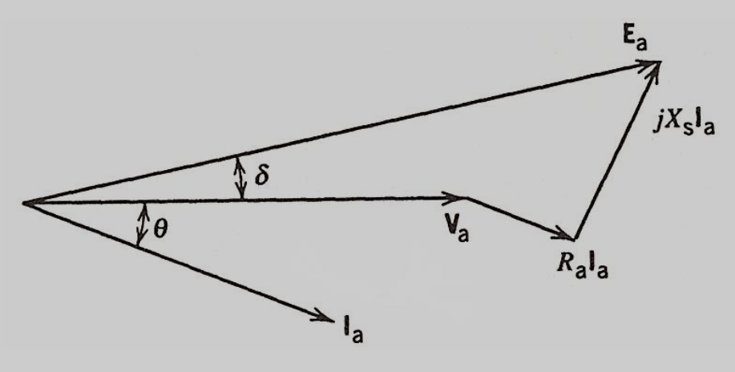

# Synchronous Machines

## Operation Characteristics

The frequency-speed relation of a synchronous generator is given by,
$$
\Large f = \frac{pn}{120}
$$
The RMS value of the generated voltage $\large E_a$ is given by,
$$
\Large E_a = \pi\sqrt{2} \: N \phi f = 4.44 \: N \phi f, \:\:\:\:\:\: \phi = BA
$$

## Equivalent Circuit

$$
\Large V_a = E_a - I_a (R_a + X_s j)
$$
where,

- $\large R_a$ is armature resistance
- $\large X_s$ is synchronous reactance
- $\large \delta$ is the power angle of the synchronous generator

## Power

The complex power of a synchronous generator is given by,
$$
\Large S = 3 V_a I_a^*
$$
Neglecting $\large R_a$, the active and reactive power are given by,
$$
\Large P = 3 \frac{\abs{E_a} \abs{V_a}}{X_s} \sin \delta \\[10pt]
\Large Q = 3 \Bigg[ \frac{\abs{E_a} \abs{V_a}}{X_s} \cos \delta - \frac{V_a^2}{X_s} \Bigg]
$$
