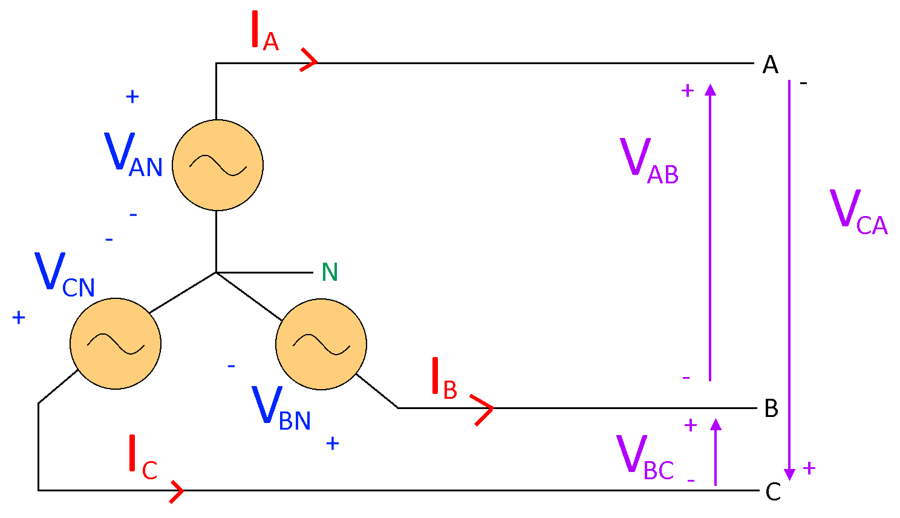
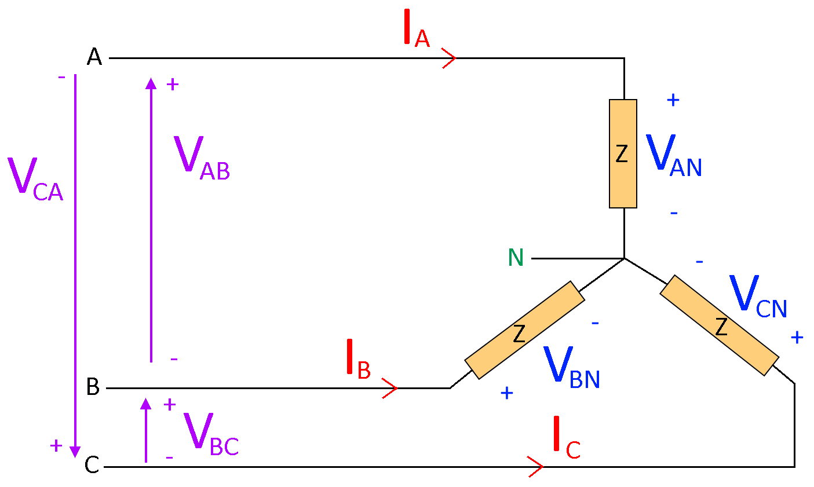
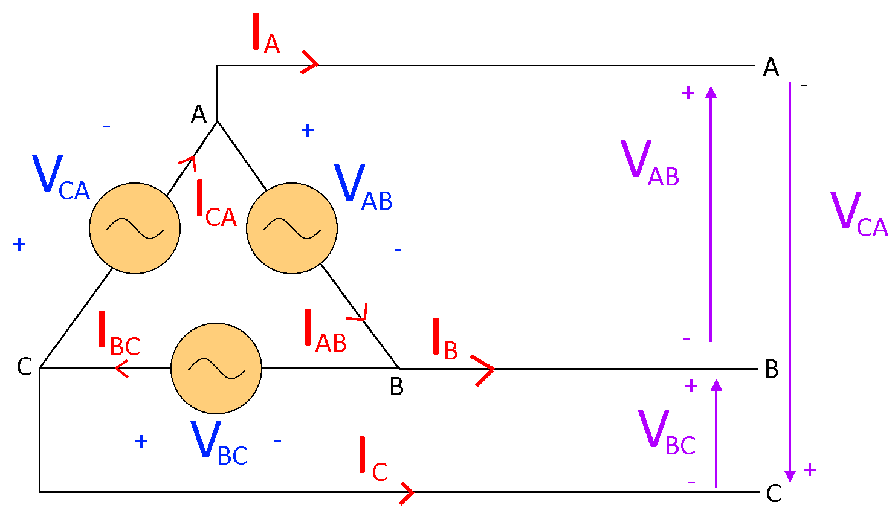
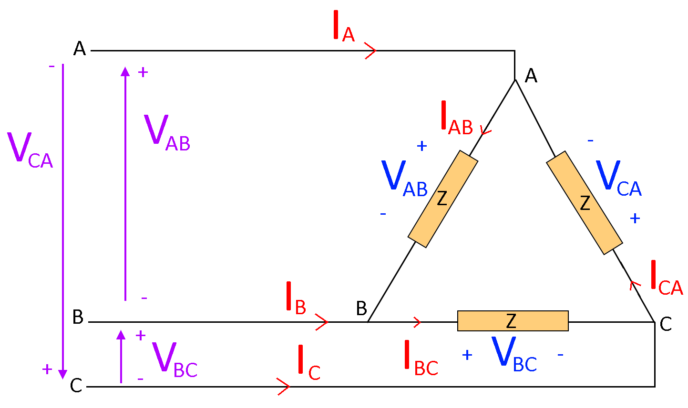
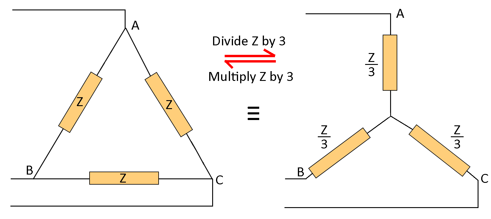

# Three-Phase Circuits

## Y-Connection

### Source

$$
\huge V_{line} = V_{phase} * \sqrt{3} \angle{30\degree} \\[10pt]
\huge I_{line} = I_{phase}
$$

### Load

$$
\huge V_{line} = V_{phase} * \sqrt{3} \angle{30\degree} \\[10pt]
\huge I_{line} = I_{phase} \\[8pt]
\huge I_A = \frac{V_A}{Z},\: I_B = \frac{V_B}{Z},\: I_C = \frac{V_C}{Z}
$$

## Δ-Connection

### Source

$$
\huge V_{line} = V_{phase} \\
\huge I_{line} = I_{phase} * \sqrt{3} \angle{-30\degree}
$$

### Load

$$
\huge V_{line} = V_{phase} \\[10pt]
\huge I_{line} = I_{phase} * \sqrt{3} \angle{-30\degree} \\[8pt]
\huge I_{AB} = \frac{V_{AB}}{Z},\: I_{BC} = \frac{V_{BC}}{Z},\: I_{CA} = \frac{V_{CA}}{Z}
$$

## Summary

Assume $\large V_{phase} = V_{rms} \angle{0\degree}$ and $\large I_{phase} = I_{rms} \angle{0\degree}$

Y-Connection | Δ-Connection
--- | ---
$\Large V_{phase} = V_A = V_{rms} \angle{0\degree}$ | $\Large V_{phase} = V_{AB} = V_{rms} \angle{0\degree}$
$\Large V_{line} = V_{AB} = \sqrt{3} V_{rms} \angle{30\degree}$ | $\Large V_{line} = V_{phase} = V_{AB} = V_{rms} \angle{0\degree}$
$\Large I_{phase} = I_A = \frac{V_A}{Z} = I_{rms} \angle{\phi}$ | $\Large I_{phase} = I_{AB} = \frac{V_{AB}}{Z} = I_{rms} \angle{\phi}$
$\Large I_{line} = I_A = I_{phase} = I_{rms} \angle{\phi}$ | $\Large I_{line} = I_A = \sqrt{3} I_{phase} \angle{-30\degree} = \sqrt{3} I_{rms} \angle{\phi - 30\degree}$

## Y-Δ Conversion

To convert from Y to Δ, multiply the impedances by 3, and to convert from Δ to Y, divide the impedances by 3.

## Power

The **active power** $\large P_{3\phi}$, **reactive power** $\large Q_{3\phi}$, **apparent power** $\large S_{3\phi}$ and **power factor** $\large pf_{3\phi}$ for three-phase circuits are given by:
$$
\huge P_{3\phi} = 3 \abs{V_{phase}} \abs{I_{phase}} \: cos \phi \\[5pt]
\huge P_{3\phi} = \sqrt{3} \abs{V_{line}} \abs{I_{line}} \: cos \phi \\[5pt]
\huge Q_{3\phi} = 3 \abs{V_{phase}} \abs{I_{phase}} \: sin \phi \\[5pt]
\huge Q_{3\phi} = \sqrt{3} \abs{V_{line}} \abs{I_{line}} \: sin \phi \\[5pt]
\huge S_{3\phi} = 3 V_{phase} \: I_{phase}^* \\[5pt]
\huge \abs{S_{3\phi}} = 3 \abs{V_{phase}} \: \abs{I_{phase}} \\[5pt]
\huge \abs{S_{3\phi}} = \sqrt{3} \abs{V_{line}} \: \abs{I_{line}} \\[5pt]
\huge pf_{3\phi} = cos(\theta_{v_{phase}} - \theta_{i_{phase}})
$$
