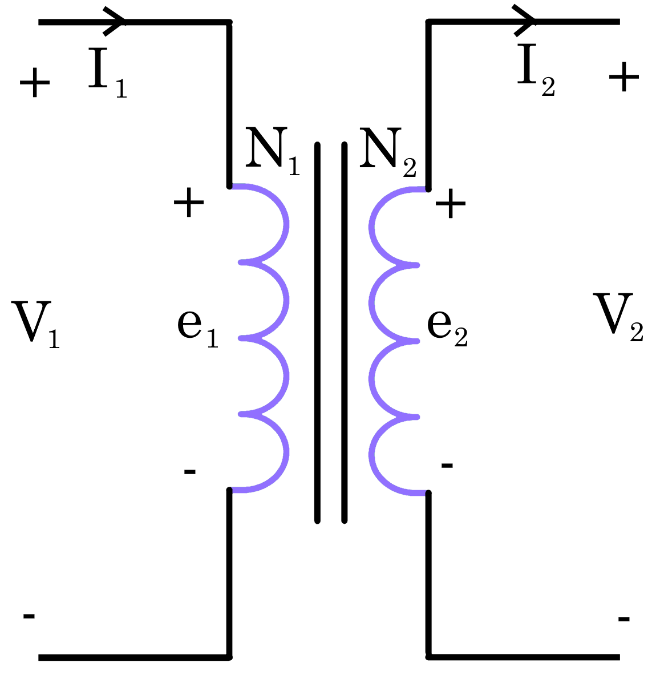

# Transformers

## Ideal Transformer

$$
\Large e_1 = N_1 \frac{d\Phi}{dt}, \:\: e_2 = N_2 \frac{d\Phi}{dt} \\[15pt]
\Large \frac{e_1}{e_2} = \frac{N_1}{N_2} = \frac{V_1}{V_2} = \frac{I_2}{I_1} = a
$$

## Exact Equivalent Circuit of a Transformer

## Approximate Equivalent Circuit of a Transformer

## Referring Rules

Secondary $\large \to$ Primary | Primary $\large \to$ Secondary
--- | ---
$\Large V_2 \to a V_2$ | $\Large V_1 \to \frac{V_1}{a}$ 
$\Large R_2 \to a^2 R_2$ | $\Large R_1 \to \frac{R_1}{a^2}$ 
$\Large X_2 \to a^2 X_2$ | $\Large X_1 \to \frac{X_1}{a^2}$ 
$\Large I_2 \to \frac{I_2}{a}$ | $\Large I_1 \to a I_1$ 