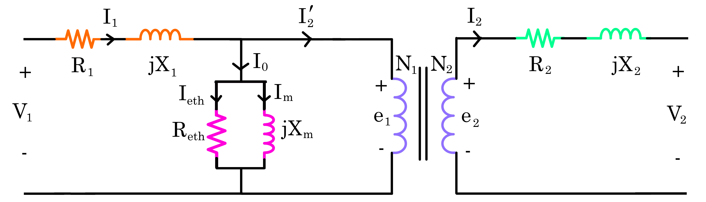

# Transformers

## Ideal Transformer

$$
\Large e_1 = N_1 \frac{d\Phi}{dt}, \:\: e_2 = N_2 \frac{d\Phi}{dt} \\[15pt]
\Large \frac{e_1}{e_2} = \frac{N_1}{N_2} = \frac{V_1}{V_2} = \frac{I_2}{I_1} = a
$$

## Exact Equivalent Circuit of a Transformer

## Approximate Equivalent Circuit of a Transformer

## Referring Rules

Secondary $\large \to$ Primary | Primary $\large \to$ Secondary
--- | ---
$\Large V_2 \to a V_2$ | $\Large V_1 \to \frac{V_1}{a}$ 
$\Large Z_2 \to a^2 Z_2$ | $\Large Z_1 \to \frac{Z_1}{a^2}$ 
$\Large I_2 \to \frac{I_2}{a}$ | $\Large I_1 \to a I_1$ 

## Three-Phase Transformers

Connection | Note
--- | ---
$\Large Y - \Delta$ | Commonly used to **step down** voltage. Neutral point on high-voltage side can be grounded, which is desirable in most cases.
$\Large \Delta - Y$ | Commonly used to **step up** voltage.
$\Large \Delta - \Delta$ | Advantage: one  transformer can  be removed for repair and the remaining two can continue to deliver three-phase power at a reduced rating of 58% of the original bank. This is known as the open-delta or V connection.
$\Large Y - Y$ | Rarely used due to problems with the exciting currents and induced voltages.